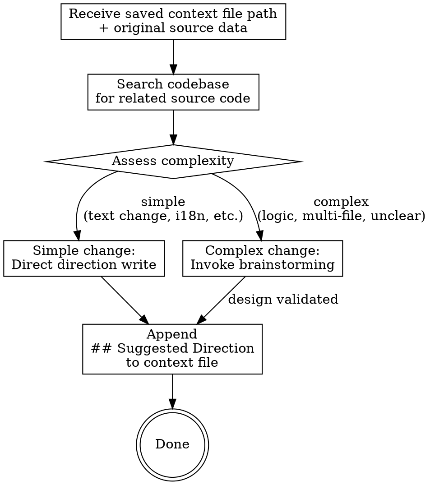

# Verify Direction & Suggest

## Overview

After saving a context markdown file, compare the analysis content against original source data and project source code to produce a `## Suggested Direction` section appended to the file.

## When to Use

- Automatically invoked by `analysis-context` after successfully saving a context file
- Not intended for direct user invocation

## Core Flow



## Step 1: Gather Context

From the saved context file, extract:
- Source data (description, expected result, current result, image analysis)
- Related file paths (if mentioned)

## Step 2: Search Codebase

Search the project source code for files related to the issue:
- Use keywords from the issue description
- Locate relevant components, utilities, constants, i18n keys
- **Read actual source code** to understand current implementation

## Step 3: Assess Complexity

| Complexity | Criteria | Action |
|------------|----------|--------|
| Simple | Text change, i18n key addition/update, single-file obvious fix, direction is unambiguous from source code | Directly write suggested direction |
| Complex | Multi-file changes, logic changes, unclear root cause, multiple possible approaches | Invoke `superpowers:brainstorming` for full collaborative analysis |

### Simple Path

Directly produce the `## Suggested Direction` content based on source code analysis. Include:
- Which file(s) to modify
- What to change (with code references)
- Confidence level

### Complex Path

Invoke `superpowers:brainstorming` with context:
- Issue summary from context file
- Source code findings
- Identified ambiguities

Brainstorming will run its full flow (clarifying questions, 2-3 approaches, design validation). The validated design becomes the `## Suggested Direction` content.

## Step 4: Append to Context File

Append the section to the saved context markdown file:

```markdown

## Suggested Direction

**Complexity**: Simple | Complex
**Confidence**: High | Medium | Low

### Analysis

{Source code findings and comparison with issue requirements}

### Recommended Changes

- `{file_path}`: {what to change and why}
- `{file_path}`: {what to change and why}

### Notes

{Any caveats, assumptions, or open questions}
```

After appending, confirm:

```
已將修改方向建議附加至 `docs/context/{filename}`。
```

## Edge Cases

| Situation | Handling |
|-----------|----------|
| No related code found | Note in direction, suggest manual investigation |
| Ambiguous between simple/complex | Default to complex (invoke brainstorming) |
| Brainstorming cancelled by user | Write partial direction with note that analysis was incomplete |
| Context file was not saved (user declined) | Skip entirely — this step only runs after successful save |
