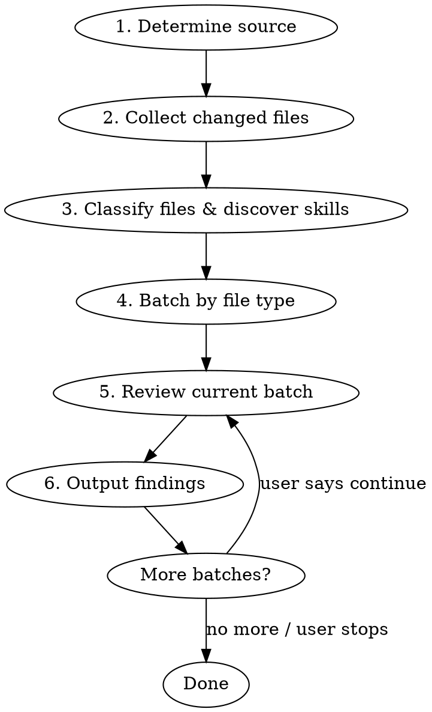

# Code Review

## Overview

Deep code review skill that orchestrates a base checklist plus dynamically loaded rule skills. Produces structured findings with four severity levels in Traditional Chinese.

**Core principle:** Systematic, skill-driven review — automatically discover and load only the rules relevant to the changed files, apply them thoroughly. This skill is a pure analysis engine — it produces findings but does NOT handle delivery (posting to PR, submitting reviews). Orchestrator skills (e.g., `review-workflow`) handle delivery.

## When to Use

- Invoked by orchestrator skills (`review-workflow`) to perform analysis
- Invoked by other skills that need code quality analysis on changed files

**Do NOT use when directly triggered by user.** All user-facing review requests go through `review-workflow`:
- User provides a GitHub PR URL → `review-workflow` (pr-review)
- User asks to review current branch / a specific branch → `review-workflow` (local-branch)
- User says "code review" / "幫我 review" → `review-workflow`

This skill is a rule engine, not a user-facing workflow.

## Process



### Step 1: Determine Source

| Source | Detection |
|--------|-----------|
| GitHub PR | User provides a PR URL or PR context is available |
| Local changes | No PR context; review current working directory changes |

**GitHub PR:** Search available skills for one that handles reading GitHub PR context. Use it to gather PR metadata, diff, comments, and linked resources before proceeding.

**Local changes:** Collect directly via git commands.

### Step 2: Collect Changed Files

**GitHub PR:**
- File list and diff from PR context gathered in Step 1

**Local changes:**
```bash
# Package boundary from cwd
# Tracked modified files (staged + unstaged)
git diff --name-only HEAD -- <package-path>

# Untracked new files
git ls-files --others --exclude-standard <package-path>
```

Skip: deleted files, binary files (images, fonts). For renamed files, review the new path only.

If no changed files → report "沒有偵測到變更檔案" and stop.

### Step 3: Classify Files & Discover Skills

#### 3a. File Classification

Classify each changed file:

| Category | Pattern |
|----------|---------|
| Core logic | `.js`, `.vue` (non-page) |
| Test files | `*.test.js`, `*.spec.js` |
| Config/Style/Other | `.scss`, `.json`, `.md`, config files, etc. |

#### 3b. Page Detection

To distinguish page-level `.vue` from component `.vue`:

1. Read router config files (search for `routes` directory or `router/` directory)
2. Extract file paths referenced in route definitions
3. Also check common conventions: `src/pages/`, `src/views/`
4. `.vue` files matching these paths = page-level

#### 3c. Skill Discovery (Stage 1 — Candidate Identification)

This step produces a **candidate skill list**. Skill SKILL.md bodies are NOT read here — they are read on demand in Step 5 (Stage 2 activation).

##### Mandatory Skills

Certain skills are always candidates when file conditions are met:

| Condition | Mandatory Skill |
|-----------|----------------|
| Any `.js`, `.ts`, `.vue` file changed | naming-conventions |

Mandatory skills are activated immediately at the start of Step 5 (their SKILL.md is read once before per-file iteration begins).

##### User-Specified Skills

Users can specify extra skills when triggering review, e.g.:
"review current branch，也要檢查 naming-conventions"

User-specified skills become candidates unconditionally, not subject to file type or discovery logic.

##### Dynamic Discovery

Loading order: mandatory → dynamic discovery → user-specified. The candidate set is the union of all three.

Scan all available skills' descriptions only (do NOT read SKILL.md bodies). For each skill, evaluate whether its description indicates it is relevant to **writing, modifying, or reviewing** the types of files present in the changeset. Mark as candidate if:

1. The skill's description mentions applicability to the file types being changed (e.g., `.js`, `.vue`, test files)
2. The skill's description indicates it provides rules, conventions, or quality checks relevant to code review
3. The project configuration matches any prerequisites mentioned in the skill's description (e.g., a skill that requires Storybook should only load if the project has Storybook installed)

**Do NOT add as candidate skills whose descriptions indicate they are for:**
- Creative work, brainstorming, or planning
- Reading/analyzing external resources (Jira, Confluence, Redmine)
- Saving, exporting, or generating documentation
- Language/response formatting
- Explicitly gated skills that declare themselves as such in their description (e.g. `interface-impact-check`) — these are invoked by an explicit gate, never by file-type matching. Loading them via discovery would read their full body on every changeset containing a matching file type, which is exactly the cost the gate exists to avoid.

**Special conditions:**
- When source files in testable directories (`api/`, `components/`, `composables/`, `models/`, `stores/`, `utils/`, `pages/`) are changed, add testing-related skills as candidates even if no test files are in the changeset — to check whether tests should exist but are missing
- When `.vue` files are changed, check if they are page-level (Step 3b). Page-level `.vue` files should not trigger component-specific candidate skills
- Design principles skills should be loaded in **active mode** when activated, to catch structural violations like growing conditional chains (OCP), information leakage, pass-through methods, etc.

The output of this step is a candidate list with `{skill name, applicability hint}` per entry. Each candidate's full SKILL.md is read on first applicable file in Step 5 (Stage 2 activation), then cached for the remainder of the review session.

#### 3d. Contract-Change Gate

Three stages. Cost is bounded at each. Stage 1 reads only information already in context from
Step 2 and 3a — it costs no additional reads.

**Stage 1 — Signal.** Fires if ANY of:

| # | Signal |
|---|---|
| 1 | A call site swaps a helper for a variant of it (`fnName` → `fnNameByX` / `fnNameForX`, or the reverse) |
| 2 | Diff touches `*VO.js`, `*DTO.js`, `api/**`, `constants/**`, `models/**` |
| 3 | A typedef, `@returns`, or `@param` shape declaration changes |
| 4 | An object-literal key is added or removed in a constructed or returned value |

Signal 1 is the strongest: a data contract can move while every signature stays
backward-compatible — the helper is untouched and one caller moved to a variant. Signals based
on "did a signature change" miss exactly that case.

**Stage 2 — Clear false positives.** Read the diff hunk that tripped the signal (Step 5 mandates
reading diff hunks anyway, so it is usually already in context). **Clear the gate and stop** if
the change is only:

- comments or JSDoc prose
- formatting / whitespace
- a pure rename with no shape change
- a typo fix

A file can match a path signal while its diff is two comment lines. Without Stage 2, signal 2
fires constantly.

**Stage 3 — Dispatch.** A confirmed contract change → invoke the `interface-impact-check` skill
by name. It returns findings that merge into Step 6 output.

If the gate does not fire, or Stage 2 clears it, **no additional cost is incurred** — do not
load `interface-impact-check`.

### Step 4: Batch by File Type

See [batch-strategy.md](references/batch-strategy.md) for details.

When total changed files exceed 15, split into batches by file type. Otherwise process all in a single pass.

### Step 5: Review Current Batch

**Activation prelude (run once before per-file loop):**

1. Read SKILL.md of every **mandatory** candidate (e.g., naming-conventions) and cache its rules
2. Read SKILL.md of every **user-specified** candidate and cache its rules
3. Initialize an empty `activated` set; mandatory + user-specified candidates start in `activated`

For each file in the batch:

1. **Read full file** for structural checks
2. **Read diff hunks** for change-specific checks (local: `git diff HEAD -- <file>`, PR: from PR diff)
3. **New/untracked files** → read full file
4. **Stage 2 activation (per-file)** — for each candidate from Step 3c not yet in `activated`:
   - Check whether its applicability hint matches THIS file
   - If matched → read its SKILL.md once, cache rules, add to `activated`
   - If unmatched → leave as candidate (may activate on a later file)
   - If SKILL.md read fails (file missing, parse error) → skip this skill for this file, log a warning, continue
5. **Duplicate suppression** — before emitting a finding, scan the target line ±3 lines for an existing `// TODO: ... (ref: branch-review-...)` comment. If found and the TODO description semantically matches the finding, skip it.
6. **Apply base checklist** — see [checklist.md](references/checklist.md)
7. **Apply activated skill rules** — evaluate against each activated skill's criteria
8. **Classify scope** (if branch objective provided) — see Step 5b below

#### 5a. Design Principles: Enclosing-Scope Rule

When software-design-principles is loaded in active mode, do NOT limit its analysis to diff lines. For each diff hunk, identify the **enclosing scope** (the function, method, or class that contains the changed lines) and evaluate that entire scope against design principles — even if most of the scope is unchanged code.

**Why:** Design principle violations (OCP growing if-chains, information leakage, pass-through methods) are structural patterns visible only at the full method/class level. A diff adding one more branch to an existing if-chain is individually innocuous, but the enclosing method's accumulated structure is the real issue.

**Procedure:**
1. For each diff hunk, identify the enclosing function/method/class
2. Read and evaluate the **full enclosing scope** against the design principles quick reference table
3. If the PR's change **extends or reinforces** an existing structural violation (e.g., adds another branch to a growing if-chain, duplicates an existing pattern), flag it — even though the violation predates this PR
4. Severity: use MEDIUM for pre-existing violations worsened by the PR, HIGH if the PR introduces a new structural violation

**Enclosing-Scope Checkpoint (mandatory):** Before outputting findings for a batch, verify that every enclosing scope identified in step 1 has been evaluated. For each scope, confirm:
- OCP: Does it have growing if/switch chains?
- Information Hiding: Does it use string-based dynamic property access or expose internal structure?
- SRP: Does it mix multiple responsibilities?
- Parallel code path consistency (checklist #17): If `parallel-path-consistency` skill is loaded, **skip** — that skill owns this check via Step 5c. Otherwise, fall back to inline check: if the diff adds a new side effect (dispatch, commit, emit, API call, state mutation) in one branch or after a conditional block, do sibling branches that handle related entities (child types, variant types, sub-items) also need the same side effect?

If any scope was identified but not evaluated, go back and evaluate it before proceeding.

#### 5b. Branch-Scoped Classification

When a **branch objective** is provided (by `branch-review-workflow` or the user), classify each finding as `in-scope` or `out-of-scope`:

| Situation | Scope |
|-----------|-------|
| Finding directly relates to diff-added/modified logic | `in-scope` |
| Diff worsens existing problem, fix is local (small change within same function) | `in-scope` |
| Diff worsens existing problem, but fix requires large-scale refactor (file/function rewrite, cross-function changes) | `out-of-scope` |
| Pre-existing problem in same file, diff does not touch or worsen it | `out-of-scope` |
| Diff changes a data contract; sibling producers or consumers in other files are now inconsistent with it | `in-scope` |
| Problem spotted in other files | `out-of-scope` |

**Why this is not an exception to the rule below:** "Problem spotted in other files" assumes the
other file's problem **pre-existed** the diff — correctly excluded as scope creep. A contract
inconsistency is the inverse: those files were correct before this diff and are incorrect after.
The diff created it. By this table's own first row ("Finding directly relates to diff-added/modified
logic") it is already in-scope; the wording simply did not reach it.

**Key rule:** "Diff worsens existing problem" does not automatically mean in-scope. Apply a secondary **fix cost** check — if the fix is proportional (local, same function), it's in-scope; if it requires large-scale refactor, it's out-of-scope.

If no branch objective is provided, all findings default to `in-scope` (current behavior preserved).

#### 5c. Per-Skill Completeness Checkpoint

After reviewing a batch and before outputting findings, verify that every **activated** skill's Review Dimensions have been checked against every applicable file.

**Procedure:**

1. For each activated skill that has a `## Review Dimensions` section, read its dimensions and applicability rule
2. For each file in the batch that matches the skill's applicability rule:
   - Confirm each dimension was checked (either a finding was produced, or the file was verified clean for that dimension)
   - If a dimension was skipped, go back and check it
3. Merge any new findings into the findings list

**Candidate but not activated:** Skills that remained candidates without activation indicate that no file in the batch triggered their applicability hint — there is no coverage gap to check, so they are excluded from this checkpoint. This is by design (Stage 2 activation in Step 5).

**Fallback:** If an activated skill does not have a `## Review Dimensions` section, skip the checkpoint for that skill. The review proceeds normally using the skill's rules without the checkpoint guarantee.

**Relationship to Enclosing-Scope Checkpoint (5a):** 5a ensures design principles (OCP, Information Hiding, SRP) evaluate full method/class scope. 5c ensures all activated skills' remaining dimensions are covered across all applicable files. For software-design-principles specifically, 5a covers OCP/Information Hiding/SRP; 5c only covers Pass-through. No duplication.

### Step 6: Output Findings

```
━━━━━━━━━━━━ Code Review ━━━━━━━━━━━━

檢查檔案數：{N}
候選規則：{full candidate list from Step 3c}
實際套用：{activated subset after Step 5}
Interface impact：{triggered signal} → sibling {N} / consumer {M}
Branch 目標：{objective or "未提供"}

<依 severity 分組輸出，組別固定如下、每組標 [in-scope]/[out-of-scope]；
 每組下的每條 finding 一律用「唯一 finding 格式」，跨 severity 共用同一份>

CRITICAL（必須修復）
HIGH（強烈建議修復）
MEDIUM（建議修復）
LOW（可選改善）

唯一 finding 格式（所有 severity 共用；欄位順序固定，不得重排或刪欄）：

{n}. [{category}] {issue description}
{file}:{line}
**規則來源**：{skill name}
**修復參照**：{skill name} → {specific section/rule name}
**參考依據**：{file}:{line} — {實際讀到的內容}
**導致問題**：{what this causes}
**期望目標**：{what the correct state should be}
**建議修復**：{see tiered strategy below}

**待確認**：{給作者的 runtime 問題}
（選用：finding 含未解 runtime 成分時才寫）

**合併順序**：{ticket} 已涵蓋但尚未落地，單獨 merge 會開一個窗口
（選用：ticket 涵蓋但 merge 時序有風險時才寫）

※ out-of-scope 的 finding 於該條 finding 最後一行下方加註「※ 超出 branch 目標，將以 TODO 註解標記」
※ finding 與 finding 之間空一行

━━━━━━━━━━━━━━━━━━━━━━━━━━━━━━━━━━━━

摘要：{N} CRITICAL, {N} HIGH, {N} MEDIUM, {N} LOW（in-scope: {N}, out-of-scope: {N}）
結論：{verdict}
```

When the Step 3d gate does not fire or Stage 2 clears it, the line reads `Interface impact：未觸發`.
This mirrors the `候選規則 / 實際套用` transparency lines — the reader can see what was skipped.

#### 排版（author-facing）

finding 會經過 markdown renderer 呈現 —— 可能是 GitHub PR comment，也可能是終端機的對話回覆。**兩者共用同一份輸出，不得分流。**

排版需符合：

- 每欄自成一行，格式 `**欄名**：值`——**欄名一律用粗體**（`**欄名**：`），值不加粗；建立掃描錨點，避免整段同一字重、看不出結構。
- **不做任何手動對齊或縮排。** 行首不加空白，值過長就讓 renderer 自己換行。需要視覺分隔時只用空行，不用空白。
- 核心欄與選用欄（`待確認`/`合併順序`）之間空一行。
- 可讀性優先於精簡。

##### 禁止用 HTML entity 或 tag 排版

> **HARD RULE：** finding 內容不得出現 `&nbsp;`、`&#160;`、`<br>`、`<br/>`、`&emsp;`、`&ensp;` 或任何 HTML entity / tag。**無例外。**

**為什麼會想用：** markdown 會吃掉行首空白，所以「續行對齊到值的起點」這種排版在 markdown 裡做不出來，`&nbsp;` 是唯一的達成手段。這正是本規則刪掉「續行對齊」要求的原因 —— 移除需求，而不是留著需求再用 entity 去湊。

**為什麼禁止：** GitHub 會把 entity 渲染成空白，終端機不會 —— 同一份輸出在終端機會原文印出 `&nbsp;&nbsp;&nbsp;`，整條 finding 變成雜訊。entity 只在單一 renderer 下成立，違反「兩者共用同一份輸出」。

**沒有例外出口：** 不會有「這次只貼 GitHub 所以可以用」的情況 —— 同一份 findings 會同時出現在對話回覆、PR comment、與 `docs/context/branch-review-*.md`。產出時無從得知最終落在哪個 renderer。

Golden sample：

```
[HIGH] [interface-impact] getAddOnLicenseTypes 換 byDeviceType 後，2 sibling / 3 consumer 未同步
src/utils/activationHelper.js:57
**規則來源**：interface-impact-check
**修復參照**：interface-impact-check → "Step 7: Emit"
**參考依據**：src/composables/features/useScheduleActivationHelper.js:103 — 只在 deviceType===CAMERA 時建 ADD_ON，MA2/MA4 落空
**導致問題**：MA2/MA4 這兩種裝置會拿不到雲端備份授權——producer 存進去的 key 是 CLOUD_BACKUP_MA2，consumer 卻只會去讀 CLOUD_BACKUP，兩邊 key 對不上，讀出來就是 undefined。
**期望目標**：producer 與 consumer 對同一份資料的 key 契約一致
**建議修復**：（範例方案，實際做法依討論決定）依 deviceType 補 MA2/MA4 的 ADD_ON 分支

**待確認**：MA4 通道數在此環境是否會走到未定義分支？
```

（註：上方 golden sample 為 fenced 原始樣貌；`**欄名**` 實際輸出會呈現為粗體，此處因在 code fence 內故見到 `**`。**fence 內看得到的縮排＝零，這是刻意的 —— 不要因為在 fence 裡看起來空白有效就加回縮排。**）

#### 模板所有權

本 skill 是 finding 模板的**唯一擁有者**。其他 skill 一律不得保留本模板的副本：

- **consumer（pr-review、local-branch）**：forward 本模板輸出、不自訂格式。
- **naming-conventions**：純規則，由本 skill 代排。
- **interface-impact-check**：規則/要求，其 findings merge 進本 Step 6、由本模板排版（會填 `待確認`/`合併順序` 選用欄）。
- **backend-code-review**：刻意獨立的另一格式，不對齊本模板。

若改本模板的**欄位標籤**，需同步更新仍 restate 標籤的少數 forwarder 引用：`review-workflow/references/{pr-review,local-branch,post-review-validation}.md`。

#### `參考依據` Field

Each finding MUST include a `參考依據` line stating **where you actually read the fact that makes this finding true**.

**強制 file:line 指標，不接受敘述。**

| | 範例 | 為何 |
|---|---|---|
| ❌ | 「我查過 vue-tippy 的行為」 | 敘述，憑記憶也寫得出來 |
| ✅ | `vue-tippy.mjs:4253 — tag: { default: 'span' }` | 指標，要嘛存在要嘛不存在 |

指標無法用記憶偽造 —— 這是本欄的全部作用。

**`參考依據` 與 `{file}:{line}` 不是同一件事：** `{file}:{line}` 指的是**問題被認為在哪**；`參考依據` 指的是**問題存在的依據**。兩者常常不同檔。

**成本：** Step 5 本來就強制「Read full file」+「Read diff hunks」，指標通常已在 context 裡。本欄要求的是把已經看過的東西寫下來，不是多看。

**降級是合法出口（重要）：** 規則**不是**「讀到能證明為止」，而是「**要嘛引用，要嘛降級並說明**」。永遠不存在「你必須去讀」的情況。沒有這條出口，本欄會誘發防禦性閱讀（對已確定的事也去讀 source，免得欄位開天窗），成本無上限。

#### `導致問題` Field

`導致問題` 是講給 PR 作者聽的「哪條邏輯會出錯」。用**口語**寫，讓人一眼看懂問題出在哪，不必對著符號自己推：

- **先講白話結論** —— 什麼行為會壞、影響誰（例：「MA2/MA4 這兩種裝置會拿不到授權」），再視需要補上具體 key／變數／流程當佐證。
- **不要只丟符號串**。`producer 產出 X；consumer 讀 Y → undefined` 是佐證，不是解釋 —— 至少補一句「所以會怎樣」。
- 一句講不清就**拆兩短句**：先「會發生什麼」，再「為什麼」。
- 仍受下方 Runtime 天花板約束：`導致問題` 只講能靜態證明的那一步；UI／執行結果的推測改放 `待確認`。

#### Runtime 主張的 Severity 天花板

> **HARD RULE：** 主張的對象若為 runtime 屬性，在無 runtime 證據的情況下，**severity 一律不得超過 LOW，無例外**。

**判準：**「這個主張的真假，能不能只靠讀 code 確立？」

不能 → runtime 主張。若其真假取決於**執行**（渲染結果、網路回應、時序、環境、使用者互動），讀再多 code 都只是推論。

常見案例（**舉例，非窮舉**）：rendered layout、實際 API 回應內容、時序 / race、瀏覽器或裝置行為、第三方服務回應。

**混合主張：** 一條 finding 可能同時含靜態與 runtime 成分。判斷方式是**把 `導致問題` 欄的內容拿去套上述判準** —— 天花板取決於 finding 實際主張的那一個，靜態成分再確鑿也不能拉高它。

範例：「Tippy wrapper span 存在」（靜態，可引用 source，確立）+「因此 layout 壞掉」（runtime，推論）。該 finding 主張的是 layout 壞掉 → 天花板 LOW。

**為何無例外：** 「這次推論夠強所以破例」正是產生 false positive 的那條路徑 —— 寫錯的人當下都覺得自己推論夠強。且降級不花任何 token。

**False negative 是可接受的：** 被壓到 LOW 的 finding 不會消失，仍以 comment 送達作者，且明白標示「（推測，未經 runtime 驗證）」+ 請其確認。作者是驗證成本最低的人（branch 在他手上、環境開著）。降級是**移交**，不是遺漏。反向的傷害更大：severity 是共用貨幣，在不可驗證的主張上灌水會讓所有 MEDIUM 一起貶值。

#### `建議修復` Tiered Strategy

「建議修復」依修正複雜度分層撰寫：

| 情境 | 寫法 | 範例 |
|------|------|------|
| 簡單明確（i18n `$t` 追加、明顯 typo） | 直接寫具體做法 | `將 "刪除" 改為 $t('common.delete')` |
| 需查閱專案才能確定（JSDoc 規格、專案慣例） | 寫明需確認的事項，不猜測具體做法 | `請閱讀專案現有 JSDoc 慣例後補上符合規格的型別定義` |
| 結構性調整（檔案拆分、模組重組、架構變更） | 寫清楚導致問題與期望目標即可；可附範例方案但須標明為範例 | `（範例方案，實際做法請依討論結果決定）可考慮提取至共用模組` |

**核心原則：不要寫出可能不正確的具體解法。** 簡單確定的事直接寫，不確定的只描述問題與目標。

#### `修復參照` Field

Each finding MUST include a `修復參照` line that points to the specific skill section(s) needed to implement the fix correctly. This field is consumed by `fix-planning` to determine complexity classification — findings with `修復參照` are automatically treated as rule-dependent (complex).

Format: `{skill name} → {section name}[, {section name}]`

Examples:
- `jsdoc-documentation → "Bare Type Prohibition", "Artifact Templates"`
- `testing-principles/component-testing → "Selector Strategy"`
- `vue-best-practices → "Options ordering"`
- `software-design-principles → "Information Hiding"`

If the fix does not require referencing any skill rule (e.g., pure typo, formatting), use: `修復參照：N/A`

**Verdict logic (based on in-scope findings only; out-of-scope findings do not affect verdict):**

| Condition | Verdict |
|-----------|---------|
| Any CRITICAL | `BLOCK — 請先修復 CRITICAL 問題` |
| Any HIGH (no CRITICAL) | `WARN — 建議修復 HIGH 問題` |
| Only MEDIUM / LOW | `PASS` |
| No issues | `PASS — 未發現問題` |

## Report Language

Always Traditional Chinese, consistent with the `language-response` custom rule. Technical terms and code stay in English.

## Boundaries

**This skill DOES:**
- Deep review of changed files against base checklist + dynamically loaded skill rules
- Provide severity-rated findings with file:line references and fix suggestions
- Identify missing test files for source code that should have tests
- Automatically discover and load relevant skills based on file types and project config

**This skill does NOT:**
- Auto-fix issues
- Handle output delivery (posting to PR, submitting reviews) — orchestrator skills handle this
- Run linter / type checker (assumes CI handles these)
- Hardcode *file-type rule-skill* loading — file-type rule discovery is dynamic via description matching. Explicitly gated skills (`naming-conventions` via Mandatory Skills, `interface-impact-check` via the Step 3d gate) are named by design.
- Review files outside the current package. (Contract-impact analysis via the Step 3d gate may read other files *within* the package; cross-package only per the evidence rule in `interface-impact-check`.)

## Common Mistakes

| Mistake | Fix |
|---------|-----|
| Skipping skill discovery, reviewing with base checklist only | Always scan available skills and load applicable ones |
| Not reading loaded skill's SKILL.md before applying rules | Must read each loaded skill's full definition |
| Ignoring missing test files because no test was changed | Check if source files SHOULD have tests, flag if missing |
| Loading component-specific skills for page-level `.vue` | Detect pages via router config / conventions, exclude them |
| Bundling multiple issues in one finding | Each finding must be separate |
| Reviewing all files at once in large PRs | Batch by file type, ask user between batches |
| Loading creative/planning/analysis skills during review | Only load skills whose descriptions indicate code quality rules |
| Applying design principles only to diff-added lines | Use the Enclosing-Scope Rule (Step 5a): evaluate the full method/class containing the diff, not just the new lines. A diff that adds one branch to an existing if-chain should trigger OCP analysis of the entire chain. |
| Identifying enclosing scopes but not evaluating all of them | Run the Enclosing-Scope Checkpoint before outputting findings — verify every identified scope was analyzed for OCP, Information Hiding, and SRP. |
| Classifying route files as config (Batch 3) | Route files (`route.js`, `router/*.js`) define permissions and guards — they are core logic (Batch 1), not config. |
| Checking JSDoc format but missing completely absent JSDoc | Check existence first, then correctness. Missing JSDoc is higher priority than imprecise types. |
| Classifying out-of-scope finding as in-scope because diff worsens existing problem | Apply fix cost check — if fix requires large-scale refactor (file/function rewrite), it's out-of-scope even if diff worsens the problem |
| Emitting finding for a line already annotated with TODO from previous review | Check ±3 lines for existing `// TODO: ... (ref: branch-review-...)` before emitting |
| Letting out-of-scope findings affect verdict | Verdict is based on in-scope findings only |
| Omitting `修復參照` or writing vague references like "see skill rules" | Must point to specific section name(s) within the skill — this drives fix-planning complexity classification |
| Writing speculative concrete fixes for structural issues in `建議修復` | Follow the tiered strategy — only write concrete fixes for simple/certain cases; for structural changes, describe problem + goal and mark examples as 「範例方案」 |
| Skipping Per-Skill Completeness Checkpoint (Step 5c) before outputting findings | Must verify every activated skill's Review Dimensions were checked for every applicable file. This is the primary mechanism preventing multi-round review convergence failures. |
| Reading SKILL.md for all candidates upfront in Step 3c | Step 3c only collects candidates by description match; SKILL.md bodies are read in Step 5 Stage 2 activation, per-file. |
| `參考依據` 欄寫敘述而非 file:line 指標（如「我查過 X 的行為」） | 必須寫 `{file}:{line} — {實際讀到的內容}`。敘述可由記憶偽造，指標不行 —— 這是本欄唯一的作用機制 |
| 把 `{file}:{line}`（問題在哪）當成 `參考依據`（依據在哪） | 兩者常不同檔。被懷疑的那一行往往證明不了問題存在 —— 例如「這個 wrapper 會破壞 layout」的 `{file}:{line}` 指向 wrapper 本身，但那行只證明 wrapper 存在 |
| runtime 主張（layout / API 回應 / 時序 / 瀏覽器行為）未經降級即給 MEDIUM 以上 | 套判準：「真假能不能只靠讀 code 確立？」不能 → 天花板 LOW，無例外。把 `導致問題` 欄的內容拿去套，不是把 `參考依據` 欄拿去套 |
| 因為填不出 `參考依據` 就去讀 source 直到能證明 | 降級是合法出口 —— 要嘛引用，要嘛降級並說明。不存在「必須去讀」 |
| Treating a contract gap as a non-defect because a ticket covers it (e.g. "T5 涵蓋，屬後續工作") | The ticket covers the future; the merge happens now. Report it, framed as a merge-order risk. Cite the ticket in the body as context, never as grounds for silence. |
| Reading an interface-impact finding's evidence list as bundled findings | It is ONE finding with an evidence list. The "do not bundle" rule targets *unrelated* issues. Affected files cannot get their own comments — they are not in the diff. |
| 用 `&nbsp;` / `<br>` 等 HTML entity 做縮排或換行 | 一律禁止。GitHub 會渲染成空白、終端機會原文印出 `&nbsp;&nbsp;&nbsp;`。改用空行分隔，值過長交給 renderer 換行 |
| 為了「續行對齊到值的起點」而手動加行首空白 | 該要求已移除。markdown 會吃掉行首空白，對齊做不出來 —— 這正是 entity hack 的來源。每欄一行、行首不縮排即可 |
| 因為 golden sample 在 code fence 內看得到空白，就以為縮排有效 | fence 內空白會保留，貼出去不會。golden sample 的縮排刻意為零，照抄即可 |
| 針對 GitHub 與終端機分別產出兩種排版 | 只有一份輸出格式。同一份 findings 會同時進對話回覆、PR comment 與 `docs/context/branch-review-*.md`，產出時無從得知落在哪個 renderer |
