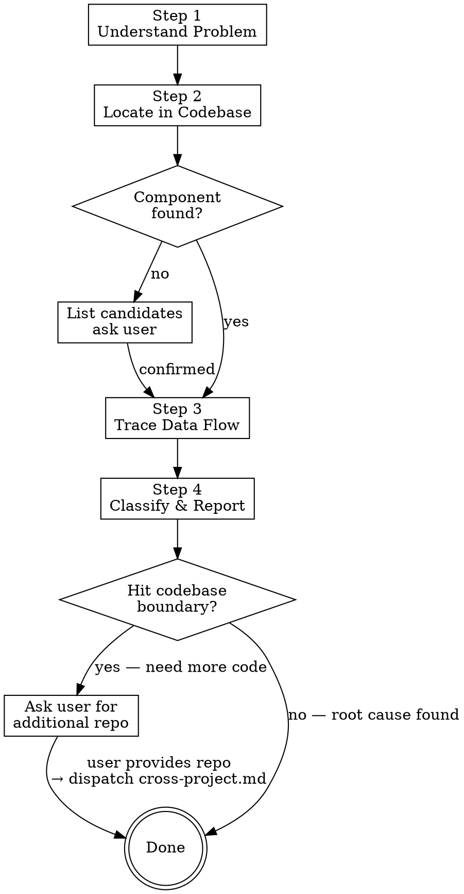

# Phase 1: Analyze Bug in Current Workspace

## Input

- Problem description (text) — from conversation context (Redmine/Jira issue, or direct user input)
- Screenshots (images) — optional, from conversation context or user-provided
- Codebase — current workspace

## Flow



## Step 1 — Understand the Problem

Extract from description and screenshots:

| Source | Extract |
|--------|---------|
| Screenshot (vision) | Page layout, UI elements, visible text, error states, empty areas |
| Description | Feature name, expected behavior, actual behavior, trigger conditions |

Synthesize into: **what should appear** vs **what actually appears**, and **where in the app**.

## Step 2 — Locate in Codebase

Try strategies in priority order. On each match, verify against description/screenshot before committing. If match doesn't fit, try next strategy:

| Priority | Strategy | Method |
|----------|----------|--------|
| 1 | Text reverse lookup | grep visible text from screenshot (page title, button label, error message) → find template or i18n key → locate component |
| 2 | Route matching | Search router config, match feature/page name → find page component |
| 3 | Directory search | Search `src/pages/` structure, match keywords from description |
| 4 | Fuzzy search | Code search for component name or related keywords |

**If none match** → list candidate pages/components, ask user to confirm before proceeding.

## Step 3 — Trace Data Flow

Starting from the located component, trace as deep as possible within the current workspace.

### Layer-by-Layer Tracing

```
Layer 1: Template
  → Find rendering condition for affected area (v-if, v-for, v-show)
  → Identify reactive data variables controlling the display

Layer 2: Script
  → Trace variable source: ref? computed? store getter? props? composable return?
  → If computed → what does it depend on?

Layer 3: Composable / Store
  → Read data source, find fetch logic / state mutation
  → Identify transformations, filters, error handling, async operations

Layer 4: API Layer
  → Identify endpoint, parameters, response handling
  → This is the current codebase boundary
```

### At Each Layer

- Record **potential breakpoints**: conditions that could cause wrong/missing data
- Note **file path + line number**
- Tag each breakpoint as **frontend** or **backend**
- Note **confidence level** (high/medium/low) based on evidence strength

### What Counts as a Breakpoint

- Conditional rendering that might evaluate wrong (type mismatch, null check, timing)
- Data filter/transformation that might exclude valid items
- Error handling that silently swallows failures
- Async operation that might not complete or race with another
- API parameter that might be wrong (wrong key, wrong format)
- Missing null/undefined guard

## Step 4 — Classify and Report

Classification is **not binary**. List all breakpoints, each tagged independently. Conclusion can be Frontend / Backend / Both.

### Output Format

```
━━━ Analysis Result ━━━

Data Flow:
  {Component}.vue template: v-if="{condition}"
    → computed: {var} ← {composable}().{property}
      → composable: {file} — {logic description}
        → store action: {action}() → {HTTP method} {endpoint}

Possible Breakpoints:

1. [{frontend/backend}] {description}
   File: {path}:{line}
   Code: {relevant snippet}
   Confidence: {high/medium/low}
   Verify: {how to check — DevTools step, API call, console log}

2. [{frontend/backend}] {description}
   ...

Classification: {Frontend / Backend / Both}

Reproduction Steps:
  Precondition: {required state — login role, data condition, feature flag}
  1. {navigate to page/route}
  2. {user action — click, input, wait}
  3. {observe: expected vs actual}
```

### Deriving Reproduction Steps

When the bug description lacks clear steps, reverse-engineer them from the trace:

| Trace result | Derive |
|-------------|--------|
| Route config / guard | Page to navigate to + preconditions (auth, role, permissions) |
| Template rendering condition | What UI state or user action triggers the affected area |
| Store action / API call | What data condition is needed (empty list, specific ID, error response) |
| Middleware / interceptor | What request state is required (token, headers, tenant) |

Write steps from the **user's perspective** — page names and UI actions, not code references.

## Codebase Boundary Handling

When the trace reaches the API layer and root cause is still uncertain:

```
⚠️ Traced to codebase boundary:

API endpoint: {method} {path}
Frontend logic appears correct. Problem may be in backend response.

Need: Please provide backend project path to continue tracing.
Or: Check this API response directly in DevTools to confirm content.
```

If user provides a project path → skill dispatches to `cross-project.md`.

## Insufficient Information Handling

| Situation | Action |
|-----------|--------|
| Cannot locate page from input | List candidates, ask user to confirm |
| Multiple possible breakpoints, can't narrow down | List all with confidence levels, suggest verification order (highest confidence first) |
| Race condition / timing suspected | Flag async operations involved, suggest adding logs to observe execution order |
| Cannot determine at all | State where trace stopped, list eliminated possibilities, suggest next investigation steps |
