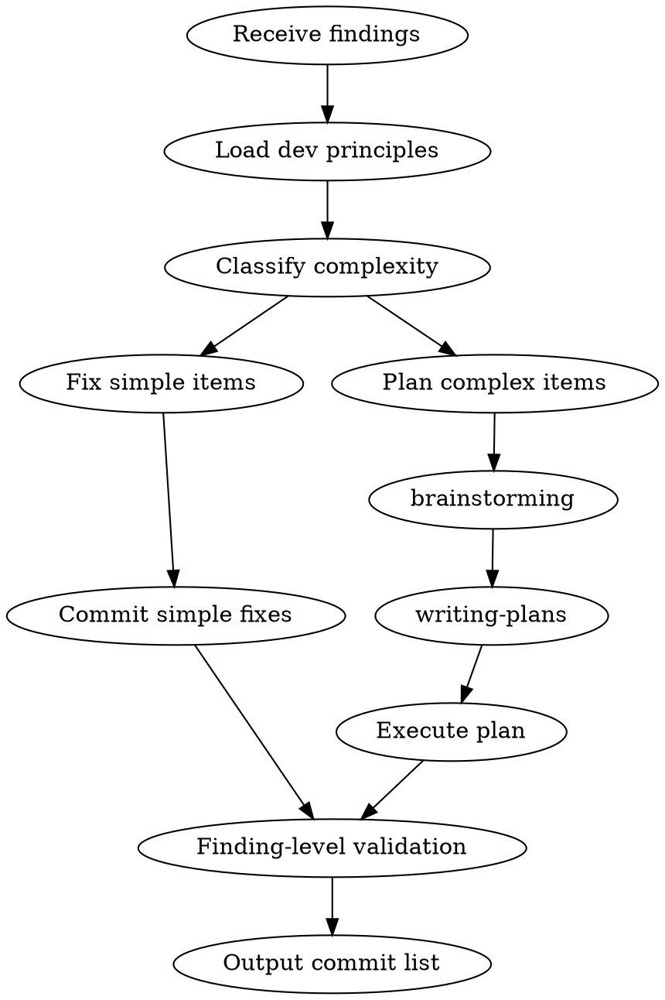

# Fix Planning

Unified flow from findings to committed fixes. Routes simple fixes directly, complex fixes through brainstorming → writing-plans.

## When to Use

- Called by `resolve-pr-review` after user confirms FIX items
- Called by `branch-review-workflow` after code-review produces findings
- Any situation with a list of code findings that need fixing

## Input

A list of findings, each with: description, file, line (optional), severity (optional), source (optional).

## Process



## Step 1: Load Dev Principles

Identify file types across all findings. Scan available skills for those applicable to writing/modifying those file types (same discovery logic as `code-review` Step 3c Stage 1). Read each matched skill's SKILL.md.

## Step 2: Classify Complexity

For each finding, classify:

| Simple | Complex |
|--------|---------|
| Typo, text, i18n `$t` key | Logic change, condition refactor |
| Import adjustment, unused variable | API interface change |
| Formatting, naming fix | Architecture change, module add/remove |
| Single file, local change | Cross-file dependency |
| Fix is obvious without reading rules | Correct fix requires understanding a specific skill's rules |

**Rule-dependent classification:** If a finding has a `修復參照` field that is not `N/A`, it is automatically **complex** — the referenced skill section(s) MUST be read before implementing the fix. Do not downgrade to simple based on perceived code change size.

## Step 3: Fix Simple Items

Apply all simple fixes directly, **referencing the dev principles loaded in Step 1** to ensure fixes comply with project rules. Group into one commit:

```bash
git commit -m "fix: address review feedback (minor fixes)"
```

## Step 4: Plan & Execute Complex Items

If no complex items → skip to Step 5.

0. **Read referenced skill sections:** For each complex finding, read the skill section(s) listed in its `修復參照` field before designing the fix approach
1. **REQUIRED SKILL:** Invoke `brainstorming` — design fix approach for complex items, applying loaded dev principles and the referenced skill rules
2. After approved design → **REQUIRED SKILL:** Invoke `writing-plans` — produce executable plan
3. Execute via user's choice:
   - `subagent-driven-development` (recommended)
   - `executing-plans`

## Step 5: Finding-Level Validation

Re-read each original finding and verify the fix is semantically correct:

- Does the fix match the finding's suggested fix or intent?
- Does the fix comply with the referenced skill's rules (e.g., if finding says "bare `Array<Object>` violates jsdoc rule", is the replacement type actually specific)?
- Did the fix introduce new issues in the same area?

If any finding is not properly addressed → fix it before proceeding.

## Step 6: Output

Return to caller:
- List of commits (short hash + message)
- Verification result (pass/fail)

The caller handles post-fix actions (e.g., `resolve-pr-review` does push + reply).

## Common Mistakes

| Mistake | Fix |
|---------|-----|
| Skipping dev principle loading | Always load before any code changes |
| Treating cross-file logic change as simple | If files have dependencies, it's complex |
| Treating rule-dependent fix as simple | If finding has `修復參照` ≠ `N/A`, it is complex — no exceptions |
| Running brainstorming for typo fixes | Only complex items need brainstorming |
| Skipping finding-level validation | Re-read each finding and verify the fix matches the intent before reporting done |
| Simple fixes ignoring loaded dev principles | Step 3 must reference Step 1 principles — don't just "make it work", make it comply |

## Boundaries

**This skill DOES:**
- Route findings by complexity
- Load applicable dev principles
- Orchestrate fix → commit → verify

**This skill does NOT:**
- Read PRs or extract comments (caller's job)
- Push to remote or reply to comments (caller's job)
- Perform code review (upstream's job)
