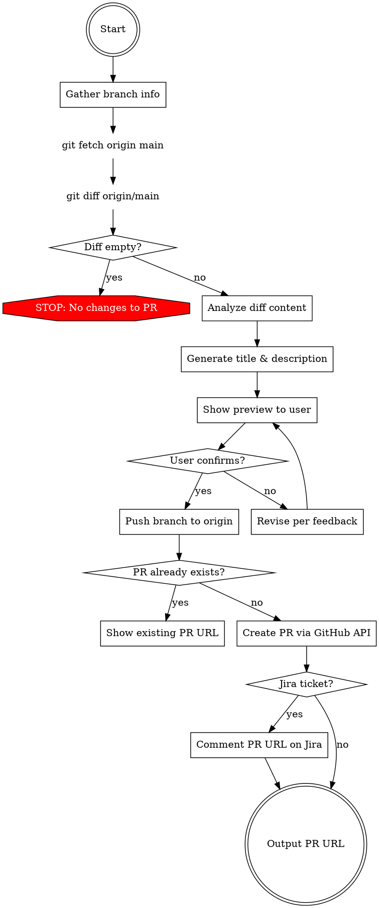

# Create PR

Automate PR creation from the current branch: analyze diff, generate title and description, push, and open PR.

## Workflow



## Quick Reference

| Item | Default | Override |
|------|---------|---------|
| Base | `origin/main` | User specifies different base |
| Remote | `origin` — the org repo `VIVOTEK-IT/webtech-monorepo` | — |
| Head | `<current-branch>` — same repo, never `<owner>:<branch>` | — |
| Push | Auto push to origin; skip if already up-to-date | — |

## Cross-Skill Invocation

When another skill or workflow needs to create a PR (e.g., after a bug fix, after branch review):

1. That workflow MUST load and execute this create-pr flow
2. The generate-pr-content.md rules for title format (scope mapping, ticket extraction) are NOT optional
3. The preview confirmation step is ALWAYS required — never skip it even if the user seems to want speed
4. If the user provides a review findings file (e.g., branch-review context file), read it BEFORE it is deleted — generate-pr-content uses it for scope-aware description

## Preview Template

```
📋 PR 預覽

Title: feat(vsaas-portal): [VOR-12345] add marker drag support
Base:  VIVOTEK-IT/webtech-monorepo main
Head:  <branch>

Description:
新增平面圖標記的拖曳功能。

- 支援在地圖上直接拖曳設備標記
- 調整事件處理邏輯以支援拖曳操作

https://dibts3.atlassian.net/browse/VOR-12345

確認要建立 PR 嗎？
```

## Implementation Details

### Gather Info

```bash
git branch --show-current
git remote -v  # origin is the org repo VIVOTEK-IT/webtech-monorepo
```

### Get Diff

```bash
git fetch origin main
git diff origin/main --stat
git diff origin/main
```

### Push

```bash
git push origin <current_branch>
```

Skip if remote tracking exists and is up-to-date.

### Create PR

Use `create_pull_request` tool:
- `owner`/`repo`: from the `origin` remote (`VIVOTEK-IT`/`webtech-monorepo`)
- `head`: the branch name alone (e.g., `jane-ry-shiu/VOR-12345/feat-some-feature`). Never prefix it with an owner — that makes a cross-repo PR, and CI rejects any PR whose head repo differs from its base repo.
- `base`: `main` (default)

### Output

```
✅ PR 已建立：https://github.com/VIVOTEK-IT/webtech-monorepo/pull/<NUMBER>
```

### Post-Creation: Link PR to Jira

If the ticket is a Jira issue (pattern `[A-Z]+-\d+`), add a comment on the Jira issue with the PR URL:

```
jira_add_comment(issue_key, body="GitHub PR: [#<NUMBER>](https://github.com/<owner>/<repo>/pull/<NUMBER>)")
```

**Note:** `jira_add_comment` accepts Markdown. Plain URLs are NOT auto-linked — use `[text](url)` markdown link syntax.

Skipped only when no ticket is identified. Work tracked in Redmine still gets a Jira ticket first (see the `redmine` skill), so there is always a Jira issue to comment on.

## Common Mistakes

| Mistake | Fix |
|---------|-----|
| Writing `head` as `<owner>:<branch>` | Same-repo PR — head is the bare branch name; the owner-prefixed form is rejected by CI |
| Forgetting to fetch before diff | `git fetch origin main` first |
| Not checking for existing PR | Check first, show URL if exists |
| Using `\n` escape sequences in `body` parameter | Use actual multi-line text in the parameter value, not `\n` literals — escape sequences get double-escaped and render as literal `\n` on GitHub |

## Edge Cases

| Situation | Action |
|-----------|--------|
| No diff vs base | Stop, inform: "目前 branch 與 origin/main 沒有差異" |
| Push fails | Show error, suggest user resolve manually |
| PR already exists | Show existing PR URL, ask if user wants to update |
| User specifies different base | Use specified base instead of `main` |
| Large diff (50+ files) | Still summarize; note "此次變更範圍較大" in description |
