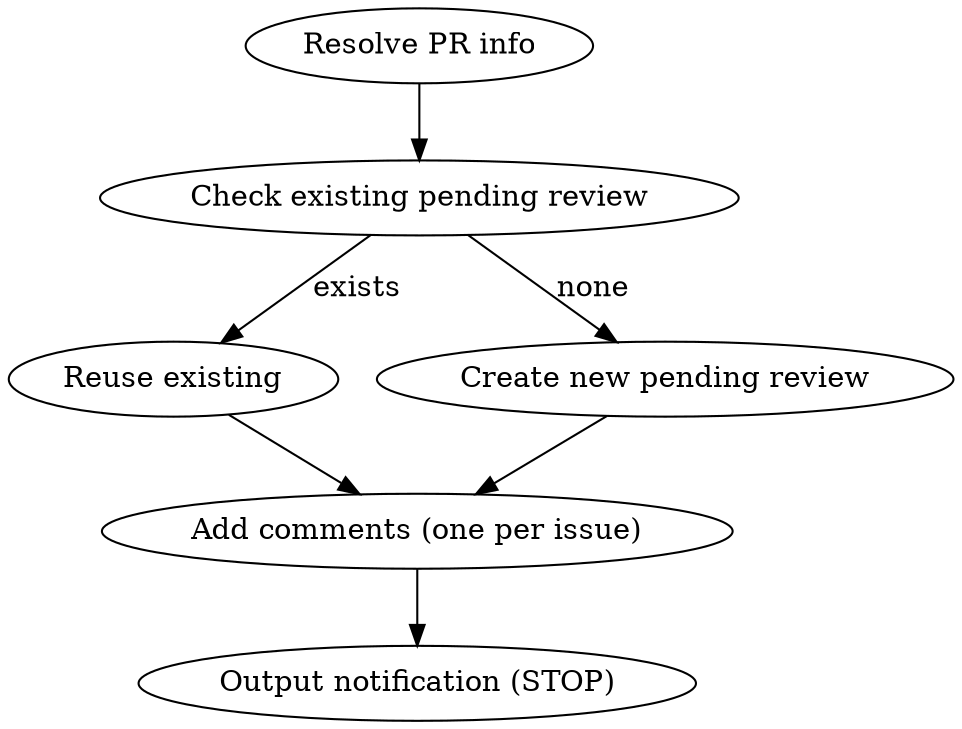

# PR Comments

The ONLY entry point for all PR comment operations.

## Rules

### 1. Language: zh-TW

All PR comment bodies use Traditional Chinese. Technical terms and code stay in English.

```
body: "建議改用 `useMemo` 避免不必要的 re-render"
```

### 2. Pending Review Only

ALL comments go through pending review. **NEVER include `event` parameter** when creating a review — omitting it creates a PENDING review.

See [pending-review.md](pending-review.md) for workflow.

### 3. One Issue Per Comment

Each issue = one `add_comment_to_pending_review` call. NEVER bundle multiple issues into one comment.

See [line-comment.md](line-comment.md) for rules and examples.

### 4. Line Annotation via Tool Parameters

Use `line`/`startLine` tool parameters for code location. NEVER write file paths or line numbers in comment body text.

**Required params for every line comment:** `path`, `line`, `subjectType: "LINE"`, `side: "RIGHT"`. For multi-line: add `startLine` and `startSide: "RIGHT"`.

See [line-comment.md](line-comment.md) for correct vs incorrect examples.

### General Notes (non-line-specific)

For general comments (e.g., overall assessment), put the text in the **review body** when creating the pending review, NOT as a separate `add_comment_to_pending_review` call without `path`.

```
mcp__github__pull_request_review_write
  method: "create"
  owner, repo, pullNumber
  body: "整體架構方向不錯，以上建議供參考。"   ← general note goes here
```

### 5. No Submit Question

After creating pending comments, output the notification and STOP. Do NOT ask about submit/discard.

**Notification format:**
```
已建立 {N} 筆 pending review comment。

請到 GitHub 預覽內容：
https://github.com/{owner}/{repo}/pull/{pr_number}
```

## Workflow



## Routing

| Scenario | Action |
|----------|--------|
| New review comments | [pending-review.md](pending-review.md) + [line-comment.md](line-comment.md) |
| Reply to existing thread | `mcp__github__add_reply_to_pull_request_comment` (direct, cannot pending) |
| Hook installation | [hook-setup.md](hook-setup.md) |

## code-review Integration

When `code-review:code-review` produces findings → this skill takes over to publish them:
1. code-review analyzes code → outputs findings
2. This skill creates pending review
3. Each finding → one `add_comment_to_pending_review` (zh-TW, line-annotated)
4. Output notification, STOP

## Common Mistakes

| Mistake | Fix |
|---------|-----|
| Using English for comment body | Use zh-TW. Technical terms stay English. |
| Including `event: "COMMENT"` to submit | NEVER include `event`. Omit = PENDING. |
| Batching issues in one comment | One issue per `add_comment_to_pending_review` call. |
| Writing `src/file.ts:42` in body | Use `line`/`startLine` tool params instead. |
| Adding summary comment listing all findings | Each finding is self-contained. No summary needed. |
| Asking "要 submit 嗎？" after creating | Just output notification. No questions. |
| Missing `subjectType`/`side` params | Always include `subjectType: "LINE"` and `side: "RIGHT"`. |
| General note as `add_comment_to_pending_review` without `path` | Put general notes in review body via `pull_request_review_write`. |
