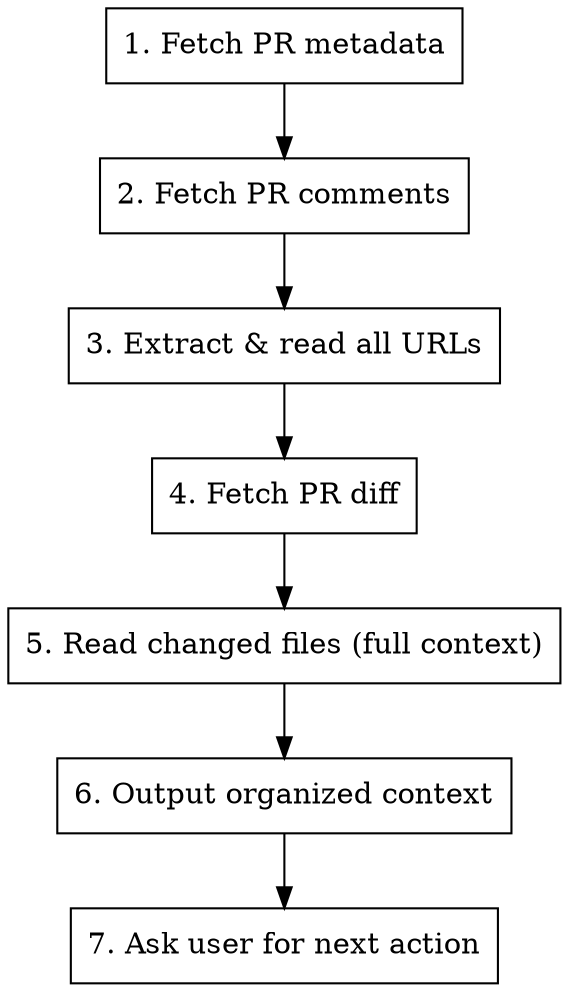

# Read GitHub PR

## Overview

When given a GitHub PR URL, gather all relevant context (metadata, diff, comments, linked URLs) and organize into a structured format. After presenting context, ask user what they want to do next.

## Workflow



### Step 1: Fetch PR Metadata

```bash
gh pr view <PR_NUMBER> --repo <OWNER/REPO> --json title,author,body,baseRefName,headRefName,state,isDraft,mergeable,statusCheckRollup
```

Gather: title, author, branch, description, state, CI status

### Step 2: Fetch PR Comments

**IMPORTANT:** Read ALL comments including review comments and conversation.

```bash
# Get PR review comments (inline code comments)
gh api repos/<OWNER>/<REPO>/pulls/<PR_NUMBER>/comments --paginate

# Get PR conversation comments (general discussion)
gh api repos/<OWNER>/<REPO>/issues/<PR_NUMBER>/comments --paginate

# Get PR reviews with their comments
gh api repos/<OWNER>/<REPO>/pulls/<PR_NUMBER>/reviews --paginate
```

### Step 3: Extract & Read All URLs

Scan the following sources for URLs and read each:
- PR description (body)
- All comments (review comments, conversation comments)
- Review bodies

| Resource Type | Pattern | How to Read |
|--------------|---------|-------------|
| Jira | `VOR-123`, `*.atlassian.net/browse/*` | Use the `jira` skill or `mcp__mcp-atlassian__jira_get_issue` |
| Confluence | `confluence.vivotek.com/*` | Use `read-confluence-page` skill or `mcp__mcp-atlassian__confluence_get_page` |
| GitHub Issue | `#123`, `github.com/*/issues/*` | `gh issue view <NUMBER> --repo <OWNER/REPO>` |
| GitHub PR | `github.com/*/pull/*` | `gh pr view <NUMBER> --repo <OWNER/REPO>` |
| Redmine | `redmine.vivotek.tw/issues/*` | Use the `redmine` skill |
| Other URLs | `https://*` | Use `WebFetch` tool |

**URL Extraction Pattern:**
```
https?://[^\s<>\[\]()'"]+
```

### Step 4: Fetch PR Diff

```bash
gh pr diff <PR_NUMBER> --repo <OWNER/REPO>
```

### Step 5: Read Changed Files

```bash
# Get list of changed files
gh pr view <PR_NUMBER> --repo <OWNER/REPO> --json files --jq '.files[].path'
```

Use `Read` tool to get full file context for each changed file.

### Step 6: Output Organized Context

Present all gathered information in this structured format:

```markdown
## PR Context: #<NUMBER>

### 基本資訊
**標題:** <title>
**作者:** <author>
**分支:** <source> -> <target>
**狀態:** <state> (Draft: <是/否>)
**CI 狀態:** <status>
**可合併:** <是/否/有衝突>

---

### PR 描述
<PR body content>

---

### 對話紀錄

#### 評論 1 - @<user> (<date>)
<comment body>

#### 評論 2 - @<user> (<date>)
<comment body>

---

### Code Review 評論

#### <filename>:<line>
**評論者:** @<user>
**內容:** <review comment body>

---

### 關聯資源

#### Jira: <KEY>
<Jira issue summary>

#### Confluence: <page title>
<Confluence page summary>

#### 其他 URL
- <url>: <content summary>

---

### 變更檔案列表
| 檔案 | 變更類型 | 新增行 | 刪除行 |
|------|---------|-------|-------|
| <path> | <added/modified/deleted> | +<n> | -<n> |

---

### Diff 內容
<PR diff>

---

### 完整檔案內容

#### <filename>
<file content>
```

### Step 7: Ask User for Next Action

After presenting context, ask:

**Question:** 已讀取完整 PR 內容，請問需要進行什麼操作？

**Options:**
1. **進行 Code Review** - 針對程式碼品質、安全性、效能等面向進行審查
2. **摘要變更內容** - 產生簡短的變更摘要
3. **檢查需求符合度** - 比對關聯的 Issue/Jira 確認實作是否符合需求
4. **其他** - 使用者自行指定

## Quick Reference

```bash
# Get PR info (JSON)
gh pr view <NUMBER> --repo <OWNER/REPO> --json title,author,body,baseRefName,headRefName,state,isDraft,mergeable,statusCheckRollup

# Get review comments (inline)
gh api repos/<OWNER>/<REPO>/pulls/<NUMBER>/comments --paginate

# Get conversation comments
gh api repos/<OWNER>/<REPO>/issues/<NUMBER>/comments --paginate

# Get reviews
gh api repos/<OWNER>/<REPO>/pulls/<NUMBER>/reviews --paginate

# Get diff
gh pr diff <NUMBER> --repo <OWNER/REPO>

# Get files list
gh pr view <NUMBER> --repo <OWNER/REPO> --json files --jq '.files[].path'

# Get PR checks status
gh pr checks <NUMBER> --repo <OWNER/REPO>
```

## Edge Cases

### Large PRs (10+ files)
Focus on core logic changes. Note: "此 PR 變更檔案較多，已聚焦於核心變更"

### Many Comments
Organize by topic/file. Highlight unresolved discussions.

### Draft PRs
Note: "此為 Draft PR，部分功能可能尚未完成"

### PRs with Merge Conflicts
Note: "⚠️ 此 PR 有 merge conflicts，需先解決"

### URLs in Comments
Always read URLs in comments - they often contain important context (design docs, related issues, external references).
