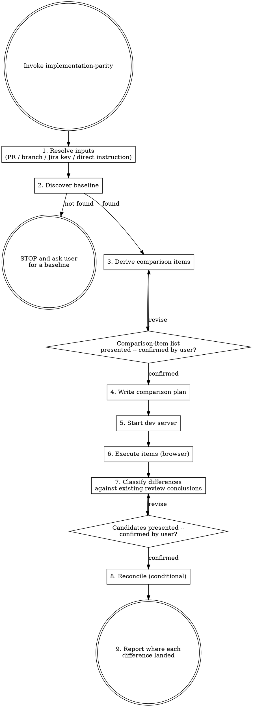

# Implementation Parity

## Overview

Compare an implementation against its baseline — a runnable prototype, a Figma frame, or a
written spec — by driving the real application in a browser, then reconcile the differences found
against whatever review conclusions already exist: adding what was missed, correcting what was
stated wrongly, and retracting differences that turn out not to exist at all.

## When to Use

- Implementation is complete and needs checking against a runnable prototype, a Figma frame, or
  written acceptance criteria
- A pending or submitted review's findings need checking against what the application actually
  does at runtime
- A timing or state-transition difference is suspected that a screenshot alone would not reveal

## When NOT to Use

- Writing tests (use test-driven-development)
- Debugging a known failure (use systematic-debugging)
- Pixel-perfect visual regression — sub-2px differences are not reliably detected here

## Baseline tiers

| Tier | Baseline | Method | Detects |
|---|---|---|---|
| 1 | Runnable prototype (demo URL, Figma prototype mode) | Same action performed on both sides | State transitions, **timing**, request dispatch |
| 2 | Figma frame | Operate implementation only, screenshot | Layout, spacing, color, typography, missing/extra elements |
| 3 | Written spec / acceptance criteria | Operate implementation only | Whether observed behavior matches the description |

## Flow



## Execution

| Step | Loads |
|---|---|
| 1 Resolve inputs | — |
| 2 Discover baseline | `references/baseline-discovery.md` |
| 3 Derive comparison items + confirm | — |
| 4 Write comparison plan | `references/plan-and-report.md` |
| 5 Start dev server | `references/dev-server.md` |
| 6 Execute items | `references/browser-operation.md`, plus `references/prototype-comparison.md` (tier 1) or `references/visual-comparison.md` (tier 2) |
| 7 Classify differences | — |
| 8 Reconcile | `references/reconcile-findings.md` |
| 9 Report where each difference landed | `references/plan-and-report.md` |

### 1. Resolve inputs

Determine what is being compared and against what: a PR under review, a branch, a Jira key, or a
direct instruction from the user naming a baseline. This context is usually already available in
the session (PR under discussion, current branch, recent commit messages) — do not ask the user to
repeat what is already visible.

No reference to load.

### 2. Discover baseline

Locate the baseline artifact: a runnable prototype URL, a Figma frame link, or a written
spec/acceptance criteria. Search in the order the reference describes, going up to the parent/epic
level before declaring failure. If nothing is found, stop and ask the user rather than guessing —
this is the flow's only unconditional stop.

Load: `references/baseline-discovery.md`

### 3. Derive comparison items + confirm

Build the comparison-item list using the baseline-authoritative / diff-supplementary rule below.
Present the list to the user and wait for confirmation before doing anything else — this is
HARD-GATE rule 1, and it holds even when the list looks obvious. No browser opens before this
confirmation lands.

**Each item is presented with what it needs, and whether that is already true.** Test data, a
feature flag, a second account, a particular org — name the requirement next to the item and mark it
satisfied or not. An item whose requirement is unmet is heading for `SKIP`; say so at this gate,
while the user can still supply the data, turn the flag on, or drop the item. Discovering it after
the run means the work was spent to produce "could not determine", which the list could have
predicted. A run that ends with several SKIPs whose causes were all knowable up front failed at this
step, not at execution.

No reference to load.

### 4. Write comparison plan

Write the confirmed item list into a plan file. This file is not a scratch artifact — it is also
the eventual report, gaining the pending-comment backup and the difference dispositions as the run
proceeds.

Load: `references/plan-and-report.md`

### 5. Start dev server

Ensure the implementation's dev server is running and reachable before any browser operation
begins. Track whether this skill started the server, so cleanup only stops what it started.

Load: `references/dev-server.md`

### 6. Execute items

Drive the browser through each comparison item in order. One item opens only after the previous
item reaches a terminal status — batch-closing several items at once is forbidden. The single
exception is a tier-1 comparison whose two sides need different logins: that runs as two passes with
an explicit non-terminal state between them, defined in `references/plan-and-report.md`'s
`### The identity-conflict exception`. Batch-closing stays forbidden there too.

Load: `references/browser-operation.md` for the lane setup and operating mechanics, plus
`references/prototype-comparison.md` for tier 1 items or `references/visual-comparison.md` for
tier 2 items, depending on which tier the item's baseline is.

### 7. Classify differences

Cross-check every observed difference against whatever review conclusions already exist, using the
four dispositions: add, already covered, correct, retract. Consume the deliberate/not-deliberate
annotation step 6 already attached to each difference — a deliberate choice is not a defect — do
not re-derive it here.

No reference to load.

### 8. Reconcile

Present the candidate dispositions and wait for the user to confirm before touching anything on a
PR — this is HARD-GATE rule 2. Back up every existing pending comment verbatim before any
mutation, regardless of which path runs afterward.

Load: `references/reconcile-findings.md`

### 9. Report where every difference landed

Not counts alone. Name each difference beside its destination and its identifier, and keep the two
PR destinations apart: a comment in the pending review is visible to nobody but the reader of the
message until they submit it, while a PR conversation comment is already in front of the author.
Report-only findings are the ones most easily lost, and they are where the most valuable finding —
specified but never implemented — lands by construction. The exact template is in the reference.

Load: `references/plan-and-report.md`

## Comparison item derivation

**The baseline side is authoritative; the diff is supplementary.** An intersection of the two
would exclude exactly the most valuable category — behavior the spec requires that was never
implemented leaves no trace in the diff.

| Class | Rule |
|---|---|
| Must compare | Covered by the baseline and inside the ticket's stated scope (its Scope / Out-of-scope sections, and any scope decision recorded in comments) — regardless of whether the diff touches it |
| Also compare | Touched by the diff but absent from the baseline — possibly unrequested work |
| Skip | Neither |

## HARD-GATE

```
1. The comparison-item list is presented and confirmed by the user BEFORE any browser opens.
2. The candidate list is presented and confirmed by the user BEFORE anything on a PR is touched.
3. An item whose result cannot be determined is recorded SKIP. Never guessed PASS or FAIL.
4. Never submit a review. No `event` parameter, no `submit_pending`, no offering to submit.
```

## Reference Loading Rule

Only load the reference file needed for the current step. Do NOT load all references upfront.

## Required MCP Tools

| Purpose | MCP Server | Tools |
|---|---|---|
| Browser — baseline lane (tier 1 prototype) | chrome-devtools-a | `navigate_page`, `take_snapshot`, `take_screenshot`, `click`, `fill`, `fill_form`, `press_key`, `wait_for`, `evaluate_script`, `list_network_requests` |
| Browser — implementation lane | chrome-devtools-b | same tool set as chrome-devtools-a, bound to the implementation side |
| Figma (tier 2) | figma-remote-mcp | `get_design_context`, `get_screenshot`, `get_metadata` |
| Jira / Confluence (baseline discovery) | mcp-atlassian | `jira_get_issue`, `jira_search`, `confluence_search`, `confluence_get_page` |
| GitHub (reconciliation) | github | `pull_request_review_write`, `add_comment_to_pending_review`, `pull_request_read` |
| PR REST fallback | — | `gh` CLI (`gh api`, `gh pr view`) |
