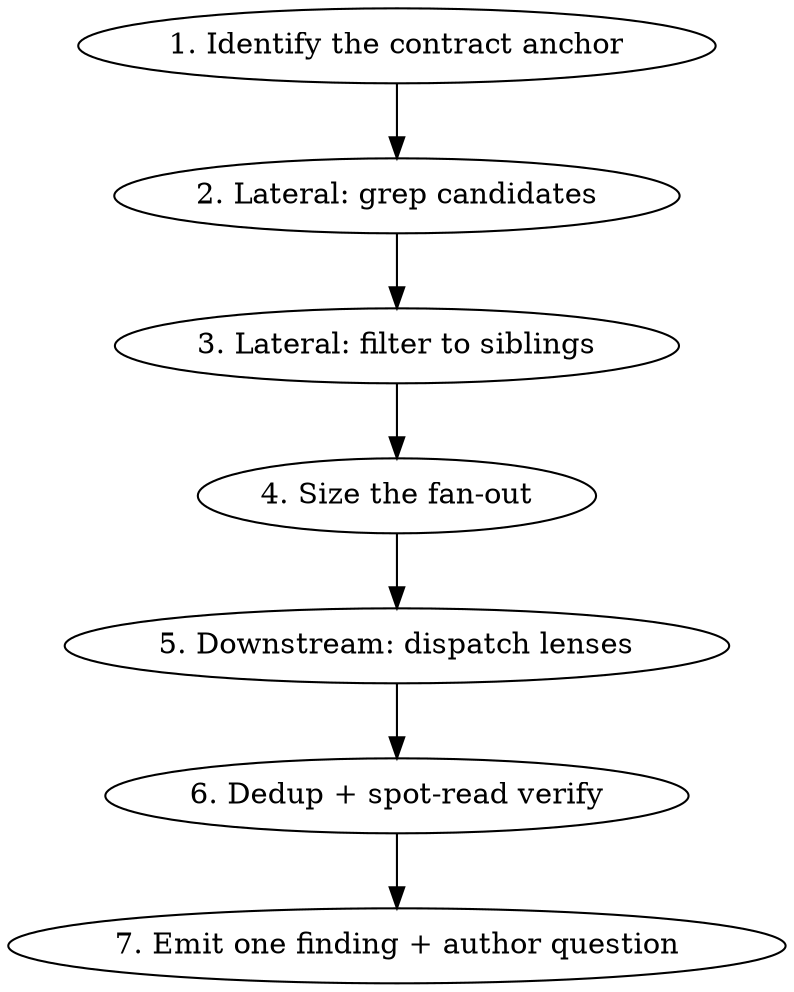

# Interface Impact Check

## Overview

When a diff changes the **shape of data** a module produces, other code that builds the same
shape, or reads it, does not automatically follow. This skill finds what was left behind.

**Core principle:** function signatures are the wrong thing to look at. A contract can break
while every signature stays backward-compatible — the helper is untouched and one of its callers
simply moved to a variant. Look at data shape, not signatures.

## When to Use

- Invoked by `code-review` Step 3 when the contract-change gate fires
- Invoked directly when a user asks who a change affects ("這個 PR 改動了哪些 interface", "有多少檔案會被影響")

**Do NOT load via dynamic discovery.** This skill is explicitly gated. Loading it on file-type
match would cost every review its full body regardless of whether any contract changed.

## Process



## Step 1: Identify the Contract Anchor

The anchor is the named thing the diff moved. In priority order:

| Anchor | Example |
|---|---|
| A helper swapped for a variant | `getAddOnLicenseTypes` → `getAddOnLicenseTypesByDeviceType` |
| A constant or enum used as a key | `LICENSE_TYPE.KEY.CLOUD_BACKUP` |
| A changed typedef / `@returns` shape | `DeviceItemVO` gains `deviceType` |
| An object-literal key added or removed | `{ CLOUD_BACKUP }` → `{ CLOUD_BACKUP_MA2 }` |

If no anchor is identifiable, skip Step 2–3 (lateral yields nothing without a name to grep) and
go to Step 4 with `siblings = unknown`, which sizes the fan-out at 3.

## Step 2: Lateral — Grep Candidates

Grep the **old** anchor name across the current package:

```bash
git grep -n "{oldAnchor}(" -- {package}/src
```

Search scope is package-first. Expand to the repo only if the changed file lives under
`core/*`, `const-vsaas`, or `lib-*`, or is imported by another package.

**The grep output is a candidate list, not an answer.** Expect a lot of noise — on the
motivating case it returned 17 hits for 6 real siblings.

## Step 3: Lateral — Filter to Siblings

Read the surrounding lines of each candidate and apply the discriminator:

> Does this call site build a **map keyed by the contract's key names, whose values hold the
> entity's data** — e.g. `Object.fromEntries(keys.map((k) => [k, []]))`, or a `reduce` into a
> keyed object, later filled with that entity's records?
>
> Or does it merely **enumerate the key names** — a column-descriptor array, a tab list, a
> `.includes()` membership check?

The first is a sibling producer. The second is not: it names the keys but never holds data under
them, so a key change surfaces there as a *consumer* problem, which the downstream lenses cover.

**Persisted vs. transient is NOT the test.** A scratch map built only to route a batch update,
never written back to any entity, is still keyed by the contract and still breaks when the keys
change. If the keys come from the anchor and data is stored under them, it is a sibling —
regardless of how long the structure lives.

Always discard: the anchor's own definition, and test files.

| Verdict | Shape it builds | Example |
|---|---|---|
| **sibling** | keyed map, values hold data | `{ [ADD_ON]: Object.fromEntries(types.map((t) => [t, []])) }` |
| discard | array of descriptors, or a membership test | `headerItems = computed(() => [...])`; `validator: (v) => types.includes(v)` |
| discard | the anchor's own definition | `export function getAddOnLicenseTypes(...)` |
| discard | test file | `*.test.js` |

**Reporting every grep hit is a failure, not caution.** Noise is what makes the check ignorable.

## Step 4: Size the Fan-Out

| Lateral result | Lenses to dispatch |
|---|---|
| Siblings found | 3 — `read`, `write`, `enumerate` |
| Zero siblings (sole producer) | 1 — `read` only |
| Anchor unidentifiable | 3 |

Rationale: siblings found means the change is demonstrably partial, so downstream almost
certainly has gaps.

## Step 5: Downstream — Dispatch Lenses

Use the **`Agent` tool, all calls in a single message** so they run concurrently. Do NOT use
`Workflow` — it requires explicit user opt-in and this pass runs automatically.

Partition by **search angle**, not by directory. Each agent is blind to the others.

| Lens | Question it asks |
|---|---|
| `read` | Who reads this shape using the OLD key/name? |
| `write` | Do the NEW values flow back to a backend, into a DTO, or into cross-system matching (licence stock, inventory pairing)? |
| `enumerate` | Who builds this shape from a generic list, without using the anchor? (catches hand-rolled shapes the grep cannot see) |

The `write` lens is not optional when 3 are dispatched. On the motivating case it was the only
lens that found the most serious defect — two code paths sending different `productType` values
for the same device — because that defect lived in `MAIN`, which no `ADD_ON` grep reaches.

**Prompt template** (substitute the braces):

```
You are analyzing the blast radius of a data-contract change. Read-only: do not modify files.

CONTRACT CHANGE
  Producer:   {file}:{line}
  Anchor:     {oldAnchor} → {newAnchor}
  Old shape:  {old}
  New shape:  {new}

YOUR LENS: {read|write|enumerate}
  {the lens question from the table above}

SCOPE: {package path}. Do not leave it.

Find every location matching YOUR LENS ONLY. Other lenses cover the other angles — do not
broaden.

For each, report ONLY facts you read. Do not infer UI consequences, and do not judge severity.
Stop your causal chain at the last step provable from source. "The lookup returns undefined" is
provable. "The user sees a blank column" is not — omit it.

Return a list; for each item exactly these fields:
  file:line     — the affected location
  讀到的事實     — the last statically provable step, e.g. plans.ADD_ON['CLOUD_BACKUP'] → undefined
  方向          — read | write | enumerate
  是否 crash    — silent-degradation | throws

If you find nothing under your lens, return an empty list. Do not pad.

Do NOT read tasks.md or any ticket file — ticket mapping is handled elsewhere.
```

**Agents must not map findings to tickets.** Main context reads `tasks.md` once; three agents
each reading it is triple waste.

## Step 6: Dedup and Spot-Read Verification

1. Deduplicate the merged results by `file:line`.
2. **Read every `file:line` that will enter the comment.** Agent claims are load-bearing; do not
   relay them unread.
3. If the list is too long to verify individually, cite representative items, state the total,
   and **declare explicitly what was not verified.**

This deliberately does not dispatch a verifier round. These claims are static and citable, and
the `參考依據` field already forces citation — a refuter round buys the same guarantee twice.

## Step 7: Emit

**One finding, anchored at the producer's origin line.** GitHub review comments can only attach
to lines inside the diff, and no sibling or consumer is in the diff. This is one finding with an
evidence list — NOT multiple findings bundled, which the `pr-review` HARD-GATE prohibits.

Severity, per the `code-review` runtime-claim rule:

- `導致問題` stops at the last statically provable step. Never write the UI consequence.
- Silent degradation is worse than a throw, not better — nothing surfaces it.
- **Ceiling: HIGH. Never CRITICAL. Never BLOCK.** True severity always carries an unresolved
  runtime question.

An existing ticket is **never** grounds for silence. The ticket covers the future; the merge
happens now. Cite it as context, framed as merge-order risk.

Finding：本 skill 為規則/要求，findings merge 進 `code-review` Step 6，由其統一模板排版（本 skill 不自排）。本 skill 負責偵測、填入各欄內容，並在契約情境填入 `合併順序`/`待確認` 兩個選用欄（其定義見 code-review Step 6）。填欄的領域規則：一條 finding 錨在 producer、以 evidence list 承載受影響檔（不拆成多條）；`導致問題` 停在最後可靜態證明的一步，UI 後果是 runtime 主張 → 移到 `待確認`（見上方 severity 規則與下方 Common Mistakes）。

## Common Mistakes

| Mistake | Fix |
|---|---|
| Reporting every grep hit as a sibling | Apply the Step 3 discriminator. 17 candidates → 6 siblings on the motivating case. Noise makes the check ignorable. |
| Discarding a sibling because its map is transient / never persisted | Persisted vs transient is not the test. A scratch map built to route a batch update is still keyed by the contract and breaks identically. Measured: this exact trap made a blind reviewer unable to classify `useTableDeviceActivationTools.js:289` — the file holding the motivating case's worst defect. |
| Checking signatures instead of data shape | A contract breaks while every signature stays compatible. Look at what the data looks like. |
| Skipping the `write` lens because `read` found plenty | `write` found the worst defect on the motivating case. Silent-degradation reads are visible; wrong data sent to a backend is not. |
| Writing the UI consequence in `導致問題` | That is a runtime claim → capped at LOW → the whole pass is wasted. Stop at "returns undefined"; move the consequence to `待確認`. |
| Suppressing because a ticket covers it | The ticket covers the future; the merge happens now. Report as merge-order risk. |
| One comment per affected file | Impossible — those files are not in the diff. One finding anchored at the producer, with an evidence list. |
| Relaying agent findings without reading the line | Every item entering the comment must be spot-read by main context. |
| Using `Workflow` to fan out | Requires user opt-in; this pass is automatic. Use parallel `Agent` calls in one message. |
| Letting agents read `tasks.md` | Main context does ticket mapping once. |
