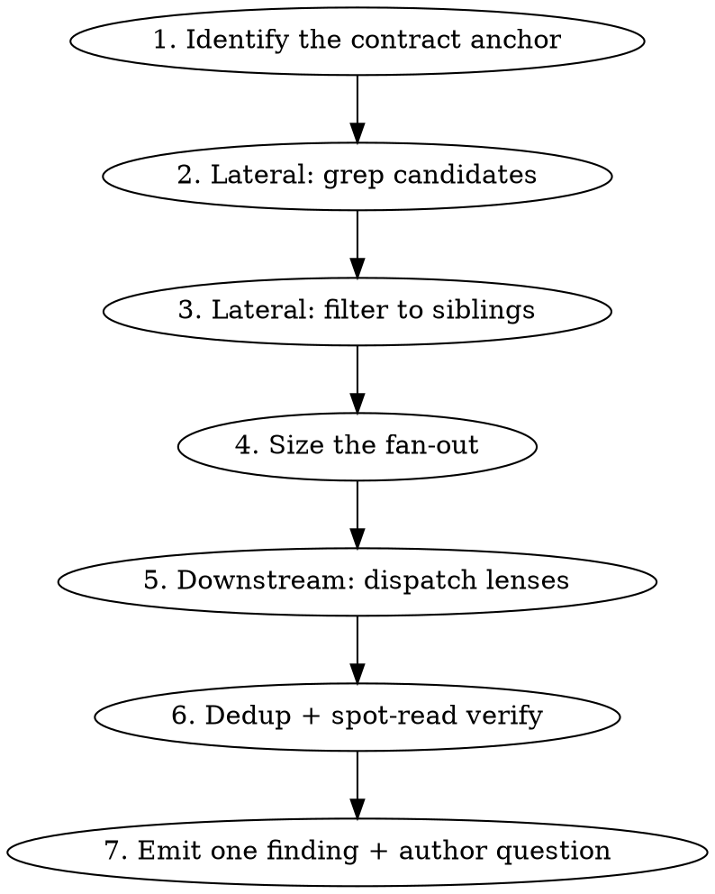

# Interface Impact Check Implementation Plan

> **For agentic workers:** REQUIRED SUB-SKILL: Use superpowers:subagent-driven-development (recommended) or superpowers:executing-plans to implement this plan task-by-task. Steps use checkbox (`- [ ]`) syntax for tracking.

**Goal:** Make `code-review` detect, at review time, when a diff changes a data contract and leaves sibling producers or downstream consumers behind — at zero token cost when no contract change occurs.

**Architecture:** A three-stage gate lives in `code-review/SKILL.md` Step 3 (mechanical signal → false-positive clearing → dispatch). On dispatch it loads a new standalone skill, `interface-impact-check`, which runs a cheap lateral pass (grep for candidates, filter by judgement) and then sizes an expensive downstream pass (parallel `Agent` fan-out across three search lenses). Findings merge into `code-review`'s existing Step 6 output, so `review-workflow` needs no changes.

**Tech Stack:** Markdown skill definitions under `~/.claude/skills/`. No build, no test runner, no package manager. Verification is shell `git grep` plus manual review runs.

## Global Constraints

- **`~/.claude` is not a git repo** (verified 2026-07-16: `git rev-parse` → `fatal: not a git repository`). **There are no commit steps in this plan.** Rollback is restoring from `~/.claude/skills/.backup-2026-07-16/`.
- **Skill file language: English.** Finding templates and user-facing output examples stay zh-TW, per `code-review`'s existing Report Language rule.
- **PR #8370 is not merged into main** (verified 2026-07-16: main's `deviceVO.js:11` still calls `getAddOnLicenseTypes`). All regression verification runs against commit `be031eac5f`, present locally along with `6ef8751469` and `7a9001d101`.
- **Repo root for all verification greps:** `~/vivotek/webtech-monorepo`
- **Severity ceiling:** interface-impact findings cap at HIGH (→ WARN). Never CRITICAL, never BLOCK.
- **Package-first scope.** Cross-package only when the changed file is under `core/*`, `const-vsaas`, or `lib-*`, or is imported by another package.
- Spec: `~/.claude/skills/interface-impact-check/docs/specs/2026-07-16-interface-impact-check-design.md`

---

## File Structure

| File | Responsibility |
|---|---|
| `~/.claude/skills/interface-impact-check/SKILL.md` **(create)** | The whole check: lateral grep + filter, fan-out orchestration, lens prompts, agent return format, verification rule, output shape. Loaded only on gate hit; also directly invocable. |
| `~/.claude/skills/code-review/SKILL.md` **(modify, 4 regions)** | Step 3: the gate. Step 3c: exclude gated skills from dynamic discovery. Step 5b + Boundaries + Common Mistakes: make findings survive. Step 6: header transparency line. |
| `~/.claude/skills/.backup-2026-07-16/code-review/SKILL.md` **(create)** | Rollback copy. Only `code-review/SKILL.md` is modified, so it is the only file needing backup. |

`review-workflow/`, `references/checklist.md`, `references/batch-strategy.md`, and `parallel-path-consistency/` are **not touched**.

---

### Task 1: The `interface-impact-check` skill body

Standalone and independently testable: the spec makes direct invocation a designed capability, so this task is verifiable before any `code-review` change exists.

**Files:**
- Create: `~/.claude/skills/interface-impact-check/SKILL.md`
- Verify against: `~/vivotek/webtech-monorepo` at commit `be031eac5f`

**Interfaces:**
- Consumes: nothing (first task)
- Produces: a skill named `interface-impact-check`, invoked as `Skill(skill="interface-impact-check")`. Task 2's gate names it verbatim. Its `description` frontmatter is deliberately worded to **prevent** `code-review` dynamic discovery from picking it up as a file-type candidate — Task 2 Step 3 depends on that wording.

- [ ] **Step 1: Write the failing test — capture the lateral ground truth**

This is the deterministic, cheap half of the check. Establish the expected numbers first.

Run:
```bash
cd ~/vivotek/webtech-monorepo
git grep -c "getAddOnLicenseTypes(" be031eac5f -- packages/app-reseller-portal/src | wc -l
git grep -n "getAddOnLicenseTypes(" be031eac5f -- packages/app-reseller-portal/src
```

Expected: **17 hits across 17 files.** Record them. The check must narrow these to exactly 6:

| Keep (sibling producer) | Line | Builds |
|---|---|---|
| `src/utils/activationHelper.js` | 11 | `createEmptyPlans()` → `{ MAIN: [], ADD_ON: Object.fromEntries(...) }` |
| `src/composables/features/useTableDeviceActivationHelper.js` | 94 | `getDefaultFormData` → `acc[ADD_ON] = reduce(...)` |
| `src/composables/features/useScheduleActivationHelper.js` | 92 | `getDefaultFormData` → `acc[ADD_ON] = reduce(...)` |
| `src/composables/features/useTableDeviceActivationTools.js` | 289 | `initTargetMap[ADD_ON] = Object.fromEntries(...)` — **transient, still a sibling** |
| `src/components/composite/FormDeviceActivationManualSetup.vue` | 127 | `originFormData[ADD_ON] = Object.fromEntries(...)` |
| `src/components/composite/FormDeviceActivationManualSetupWithoutPlan.vue` | 108 | `originFormData[ADD_ON] = Object.fromEntries(...)` |

Discard 11: `licenseHelper.js:148` (the definition), `activationHelper.test.js:56` (test), and 9 that
only enumerate key names — `SelectAddOnService.vue:42`, `TabsLicenseService.vue:67`,
`FormDeviceNewAddOnService.vue:115`, `FormDeviceAddOnServiceWithoutPlan.vue:80` (all four are
`validator: (v) => types.includes(v)`), `TableDeviceActivationCamera.vue:349`,
`TableDeviceActivationResultCamera.vue:228`, `TableDeviceInfoCamera.vue:145`,
`TableScheduleActivationCamera.vue:312`, `tenants/mn/components/composite/TableDeviceInfoCamera.vue:138`
(all five feed `headerItems` column arrays).

This is the test. **17 → 6, no more, no less.** Reporting all 17 is a failure.

**Two traps, both measured by a blind run of this procedure on 2026-07-16:**

- `useTableDeviceActivationTools.js:289` builds a **transient** map (`initTargetMap`, used only to
  route batch updates, never written back to an entity). A blind reviewer could not classify it and
  said so. It **is** a sibling — it is keyed by the contract and holds data under those keys.
  "Persisted vs transient" is not the test. This file holds the motivating case's worst defect
  (`activationConfigAutoSetup`), so misclassifying it defeats the check.
- `FormDeviceActivationManualSetupWithoutPlan.vue:108` is a real sibling. The source analysis wrote
  the row as `FormDeviceActivationManualSetup*.vue` — a **wildcard covering two files**. An earlier
  draft of this table silently dropped the second one.

- [ ] **Step 2: Run it to confirm the check does not exist yet**

Run:
```bash
ls ~/.claude/skills/interface-impact-check/SKILL.md
```
Expected: `No such file or directory` — nothing implements the narrowing.

- [ ] **Step 3: Write the skill**

Create `~/.claude/skills/interface-impact-check/SKILL.md` with exactly this content:

````markdown
---
name: interface-impact-check
description: Explicitly gated skill — invoked only by the code-review Step 3 contract-change gate, or directly by a user asking who a data-contract change affects. NOT a file-type rule skill; do NOT load via dynamic discovery or file-type matching. Analyzes which sibling producers and downstream consumers a diff's data-shape change leaves behind.
---

# Interface Impact Check

## Overview

When a diff changes the **shape of data** a module produces, other code that builds the same
shape, or reads it, does not automatically follow. This skill finds what was left behind.

**Core principle:** function signatures are the wrong thing to look at. A contract can break
while every signature stays backward-compatible — the helper is untouched and one of its callers
simply moved to a variant. Look at data shape, not signatures.

## When to Use

- Invoked by `code-review` Step 3 when the contract-change gate fires
- Invoked directly when a user asks who a change affects ("這個 PR 改動了哪些 interface", "有多少檔案會被影響")

**Do NOT load via dynamic discovery.** This skill is explicitly gated. Loading it on file-type
match would cost every review its full body regardless of whether any contract changed.

## Process



## Step 1: Identify the Contract Anchor

The anchor is the named thing the diff moved. In priority order:

| Anchor | Example |
|---|---|
| A helper swapped for a variant | `getAddOnLicenseTypes` → `getAddOnLicenseTypesByDeviceType` |
| A constant or enum used as a key | `LICENSE_TYPE.KEY.CLOUD_BACKUP` |
| A changed typedef / `@returns` shape | `DeviceItemVO` gains `deviceType` |
| An object-literal key added or removed | `{ CLOUD_BACKUP }` → `{ CLOUD_BACKUP_MA2 }` |

If no anchor is identifiable, skip Step 2–3 (lateral yields nothing without a name to grep) and
go to Step 4 with `siblings = unknown`, which sizes the fan-out at 3.

## Step 2: Lateral — Grep Candidates

Grep the **old** anchor name across the current package:

```bash
git grep -n "{oldAnchor}(" -- {package}/src
```

Search scope is package-first. Expand to the repo only if the changed file lives under
`core/*`, `const-vsaas`, or `lib-*`, or is imported by another package.

**The grep output is a candidate list, not an answer.** Expect a lot of noise — on the
motivating case it returned 17 hits for 5 real siblings.

## Step 3: Lateral — Filter to Siblings

Read the surrounding lines of each candidate and apply the discriminator:

> Does this call site **construct a bucket/shape that becomes part of the entity's data**, or
> does it merely **enumerate which options exist** for a picker or a column list?

Only the former is a sibling producer.

Always discard: the anchor's own definition, and test files.

| Verdict | Meaning |
|---|---|
| **sibling** | Builds the same shape; the diff taught one producer the new shape and not this one |
| discard | Enumerates options for UI; definition; test |

**Reporting every grep hit is a failure, not caution.** Noise is what makes the check ignorable.

## Step 4: Size the Fan-Out

| Lateral result | Lenses to dispatch |
|---|---|
| Siblings found | 3 — `read`, `write`, `enumerate` |
| Zero siblings (sole producer) | 1 — `read` only |
| Anchor unidentifiable | 3 |

Rationale: siblings found means the change is demonstrably partial, so downstream almost
certainly has gaps.

## Step 5: Downstream — Dispatch Lenses

Use the **`Agent` tool, all calls in a single message** so they run concurrently. Do NOT use
`Workflow` — it requires explicit user opt-in and this pass runs automatically.

Partition by **search angle**, not by directory. Each agent is blind to the others.

| Lens | Question it asks |
|---|---|
| `read` | Who reads this shape using the OLD key/name? |
| `write` | Do the NEW values flow back to a backend, into a DTO, or into cross-system matching (licence stock, inventory pairing)? |
| `enumerate` | Who builds this shape from a generic list, without using the anchor? (catches hand-rolled shapes the grep cannot see) |

The `write` lens is not optional when 3 are dispatched. On the motivating case it was the only
lens that found the most serious defect — two code paths sending different `productType` values
for the same device — because that defect lived in `MAIN`, which no `ADD_ON` grep reaches.

**Prompt template** (substitute the braces):

```
You are analyzing the blast radius of a data-contract change. Read-only: do not modify files.

CONTRACT CHANGE
  Producer:   {file}:{line}
  Anchor:     {oldAnchor} → {newAnchor}
  Old shape:  {old}
  New shape:  {new}

YOUR LENS: {read|write|enumerate}
  {the lens question from the table above}

SCOPE: {package path}. Do not leave it.

Find every location matching YOUR LENS ONLY. Other lenses cover the other angles — do not
broaden.

For each, report ONLY facts you read. Do not infer UI consequences, and do not judge severity.
Stop your causal chain at the last step provable from source. "The lookup returns undefined" is
provable. "The user sees a blank column" is not — omit it.

Return a list; for each item exactly these fields:
  file:line     — the affected location
  讀到的事實     — the last statically provable step, e.g. plans.ADD_ON['CLOUD_BACKUP'] → undefined
  方向          — read | write | enumerate
  是否 crash    — silent-degradation | throws

If you find nothing under your lens, return an empty list. Do not pad.

Do NOT read tasks.md or any ticket file — ticket mapping is handled elsewhere.
```

**Agents must not map findings to tickets.** Main context reads `tasks.md` once; three agents
each reading it is triple waste.

## Step 6: Dedup and Spot-Read Verification

1. Deduplicate the merged results by `file:line`.
2. **Read every `file:line` that will enter the comment.** Agent claims are load-bearing; do not
   relay them unread.
3. If the list is too long to verify individually, cite representative items, state the total,
   and **declare explicitly what was not verified.**

This deliberately does not dispatch a verifier round. These claims are static and citable, and
the `證據` field already forces citation — a refuter round buys the same guarantee twice.

## Step 7: Emit

**One finding, anchored at the producer's origin line.** GitHub review comments can only attach
to lines inside the diff, and no sibling or consumer is in the diff. This is one finding with an
evidence list — NOT multiple findings bundled, which the `pr-review` HARD-GATE prohibits.

Severity, per the `code-review` runtime-claim rule:

- `導致問題` stops at the last statically provable step. Never write the UI consequence.
- Silent degradation is worse than a throw, not better — nothing surfaces it.
- **Ceiling: HIGH. Never CRITICAL. Never BLOCK.** True severity always carries an unresolved
  runtime question.

An existing ticket is **never** grounds for silence. The ticket covers the future; the merge
happens now. Cite it as context, framed as merge-order risk.

Finding body (zh-TW, per `code-review` Report Language):

```
HIGH：{contract} 變更後，{N} 個 sibling producer / {M} 個 consumer 未同步
  {producerFile}:{line}
  規則來源：interface-impact-check
  修復參照：interface-impact-check → "Step 7: Emit"
  證據：{consumerFile}:{line} — {讀到的事實}
  導致問題：producer 產出 {newShape}；{consumerFile}:{line} 讀 {oldKey} → 取得 undefined
  期望目標：producer 與 consumer 對同一份資料的 key 契約一致
  建議修復：（範例方案，實際做法請依討論結果決定）{...}

  合併順序：{ticket} 涵蓋此範圍但尚未落地。本 PR 單獨 merge 會開一個窗口。
  待確認：{the runtime question for the author}
```

## Common Mistakes

| Mistake | Fix |
|---|---|
| Reporting every grep hit as a sibling | Apply the Step 3 discriminator. 17 candidates → 6 siblings on the motivating case. Noise makes the check ignorable. |
| Checking signatures instead of data shape | A contract breaks while every signature stays compatible. Look at what the data looks like. |
| Skipping the `write` lens because `read` found plenty | `write` found the worst defect on the motivating case. Silent-degradation reads are visible; wrong data sent to a backend is not. |
| Writing the UI consequence in `導致問題` | That is a runtime claim → capped at LOW → the whole pass is wasted. Stop at "returns undefined"; move the consequence to `待確認`. |
| Suppressing because a ticket covers it | The ticket covers the future; the merge happens now. Report as merge-order risk. |
| One comment per affected file | Impossible — those files are not in the diff. One finding anchored at the producer, with an evidence list. |
| Relaying agent findings without reading the line | Every item entering the comment must be spot-read by main context. |
| Using `Workflow` to fan out | Requires user opt-in; this pass is automatic. Use parallel `Agent` calls in one message. |
| Letting agents read `tasks.md` | Main context does ticket mapping once. |
````

- [ ] **Step 4: Run the test — verify 17 → 6**

Invoke the skill directly and give it the motivating case:

```
Skill(skill="interface-impact-check")
```
with: *"Contract anchor: `getAddOnLicenseTypes` → `getAddOnLicenseTypesByDeviceType` at `packages/app-reseller-portal/src/api/device/deviceVO.js:218` (commit `be031eac5f`). Run Steps 1–3 only (lateral). Do not fan out."*

Expected: exactly the 5 siblings from Step 1's table. **If it returns 17, or returns the UI-selector call sites, Step 3's discriminator wording is too weak — fix it before continuing.**

- [ ] **Step 5: Verify the description does not leak into dynamic discovery**

Read the `description` frontmatter and check it against `code-review/SKILL.md` Step 3c's matching rule ("whether its description indicates it is relevant to ... the types of files present in the changeset").

Expected: the description names **no file types** (`.js`, `.vue`, `.ts` must not appear) and opens by declaring itself explicitly gated. If a file type appears, remove it — otherwise Task 2's token premise collapses.

- [ ] **Step 6: Record — no commit**

`~/.claude` is not a git repo. Nothing to commit. Confirm the file exists and is non-empty:

```bash
wc -l ~/.claude/skills/interface-impact-check/SKILL.md
```
Expected: a non-zero line count.

---

### Task 2: The gate in `code-review`

Makes the check fire automatically. Independently reviewable: a reviewer could accept the gate and still reject Task 3's scope rewording.

**Files:**
- Create: `~/.claude/skills/.backup-2026-07-16/code-review/SKILL.md`
- Modify: `~/.claude/skills/code-review/SKILL.md` — Step 3 (add gate), Step 3c (exclusion), Boundaries (2 amendments)

**Interfaces:**
- Consumes: `interface-impact-check` from Task 1, invoked by exact name.
- Produces: gate signals numbered 1–4, referenced by Task 3's Step 6 header line as `{triggered signal}`.

- [ ] **Step 1: Back up before touching anything**

```bash
mkdir -p ~/.claude/skills/.backup-2026-07-16/code-review
cp ~/.claude/skills/code-review/SKILL.md ~/.claude/skills/.backup-2026-07-16/code-review/SKILL.md
diff ~/.claude/skills/code-review/SKILL.md ~/.claude/skills/.backup-2026-07-16/code-review/SKILL.md && echo "BACKUP OK"
```
Expected: `BACKUP OK`. This is the only rollback path — there is no git history here.

- [ ] **Step 2: Write the failing test — confirm the gate does not fire today**

Establish the baseline on the real diff:

```bash
cd ~/vivotek/webtech-monorepo
git diff 6ef8751469 be031eac5f -- packages/app-reseller-portal/src/api/device/deviceVO.js | grep -E "^[+-].*getAddOnLicenseTypes"
```
Expected output shows the swap — the removed generic call and the added `ByDeviceType` call. This is signal 1's raw material, present and greppable.

Then:
```bash
grep -cE "Interface impact|interface-impact-check|contract-change gate" ~/.claude/skills/code-review/SKILL.md
```
Expected: `0` — nothing in `code-review` reacts to that diff today. This is the failing test.

- [ ] **Step 3: Add the gate to Step 3**

In `~/.claude/skills/code-review/SKILL.md`, insert this section at the **end of Step 3**, immediately before `### Step 4: Batch by File Type`:

````markdown
#### 3d. Contract-Change Gate

Three stages. Cost is bounded at each. Stage 1 reads only information already in context from
Step 2 and 3a — it costs no additional reads.

**Stage 1 — Signal.** Fires if ANY of:

| # | Signal |
|---|---|
| 1 | A call site swaps a helper for a variant of it (`fnName` → `fnNameByX` / `fnNameForX`, or the reverse) |
| 2 | Diff touches `*VO.js`, `*DTO.js`, `api/**`, `constants/**`, `models/**` |
| 3 | A typedef, `@returns`, or `@param` shape declaration changes |
| 4 | An object-literal key is added or removed in a constructed or returned value |

Signal 1 is the strongest: a data contract can move while every signature stays
backward-compatible — the helper is untouched and one caller moved to a variant. Signals based
on "did a signature change" miss exactly that case.

**Stage 2 — Clear false positives.** Read the diff hunk that tripped the signal (Step 5 mandates
reading diff hunks anyway, so it is usually already in context). **Clear the gate and stop** if
the change is only:

- comments or JSDoc prose
- formatting / whitespace
- a pure rename with no shape change
- a typo fix

A file can match a path signal while its diff is two comment lines. Without Stage 2, signal 2
fires constantly.

**Stage 3 — Dispatch.** A confirmed contract change → invoke the `interface-impact-check` skill
by name. It returns findings that merge into Step 6 output.

If the gate does not fire, or Stage 2 clears it, **no additional cost is incurred** — do not
load `interface-impact-check`.
````

- [ ] **Step 4: Exclude gated skills from dynamic discovery**

Still in Step 3c, find the list beginning `**Do NOT add as candidate skills whose descriptions indicate they are for:**` and append one bullet:

```markdown
- Explicitly gated skills that declare themselves as such in their description (e.g. `interface-impact-check`) — these are invoked by an explicit gate, never by file-type matching. Loading them via discovery would read their full body on every changeset containing a matching file type, which is exactly the cost the gate exists to avoid.
```

- [ ] **Step 5: Amend the two contradicted Boundaries**

In the `## Boundaries` section under `**This skill does NOT:**`, replace this line:

```markdown
- Review files outside the current package / PR scope
```

with:

```markdown
- Review files outside the current package. (Contract-impact analysis via the Step 3d gate may read other files *within* the package; cross-package only per the evidence rule in `interface-impact-check`.)
```

And replace this line:

```markdown
- Hardcode specific skill names — all skill loading is dynamic based on description matching
```

with:

```markdown
- Hardcode *file-type rule-skill* loading — file-type rule discovery is dynamic via description matching. Explicitly gated skills (`naming-conventions` via Mandatory Skills, `interface-impact-check` via the Step 3d gate) are named by design.
```

Both are required. Without them the skill contradicts its own stated boundaries — and the second
was **already inaccurate** before this change, since the Mandatory Skills table has always
hardcoded `naming-conventions`.

- [ ] **Step 6: Run the test — verify the gate fires**

```bash
grep -cE "3d. Contract-Change Gate|interface-impact-check" ~/.claude/skills/code-review/SKILL.md
```
Expected: non-zero (was `0` in Step 2).

Then dry-run the gate logic without a full review — cheap:

Give a fresh session this diff and ask which gate signals fire:
```bash
cd ~/vivotek/webtech-monorepo
git diff 6ef8751469 be031eac5f -- packages/app-reseller-portal/src/api/device/deviceVO.js
```
Expected: **signals 1, 2, and 3 all fire**; Stage 2 does not clear it (the hunks are real logic, not comments).

- [ ] **Step 7: Run the negative test — false positives must clear**

**Do not use `licenseHelper.js` for this.** Two corrections to an earlier draft, both measured:

- Its comment-only diff is `6ef8751469..7a9001d101`, **not** `7a9001d101..be031eac5f` (that pair is
  empty — `7a9001d101` *is* the commit that added the comments).
- More importantly, it does not trip signal 2 at all: it lives in `utils/`, and signal 2's path
  list is `*VO.js` / `*DTO.js` / `api/**` / `constants/**` / `models/**`. It is a **Stage 1
  does-not-fire** case, which tests nothing about Stage 2.

Testing Stage 2 requires a diff that **matches a path signal but is not a real change**. No such
diff exists naturally in this PR (`api/device/index.js` matches the path but its 2 added lines are
a real new export). Construct one — this touches no repo:

```bash
WS=<your scratch dir>
cd ~/vivotek/webtech-monorepo
git show be031eac5f:packages/app-reseller-portal/src/api/device/deviceVO.js > $WS/deviceVO.orig.js
awk 'NR==217{print "  // NOTE: MA devices resolve their add-on bucket by device family."} {print}' \
  $WS/deviceVO.orig.js > $WS/deviceVO.commented.js
diff -u $WS/deviceVO.orig.js $WS/deviceVO.commented.js \
  | sed '1,2c\
--- a/packages/app-reseller-portal/src/api/device/deviceVO.js\
+++ b/packages/app-reseller-portal/src/api/device/deviceVO.js' > $WS/stage2-negative.diff
git status --porcelain   # must be empty — never modify this repo
```

Hand that diff to a fresh agent as a complete changeset and ask it to apply Step 3d only.

Expected: **signal 2 fires** (path), **signals 1/3/4 do not**, **Stage 2 clears it**, zero agents
dispatched. The artifact also carries a deliberate trap: `getAddOnLicenseTypesByDeviceType` appears
in the diff's *context* lines. Signal 1 requires the swap on `+`/`-` lines — **if the agent fires
signal 1 here, signal 1's wording is too loose.**

- [ ] **Step 8: Record — no commit**

```bash
diff ~/.claude/skills/.backup-2026-07-16/code-review/SKILL.md ~/.claude/skills/code-review/SKILL.md | head -40
```
Expected: shows exactly the Step 3d, 3c, and Boundaries changes and nothing else. This diff **is** the change record — there is no git history here.

---

### Task 3: Make the findings survive

Without this task the check runs and its output gets classified away — the mechanism that discarded two of the three finding classes on the motivating PR.

**Files:**
- Modify: `~/.claude/skills/code-review/SKILL.md` — Step 5b (scope row), Step 6 (header line), Common Mistakes (2 rows)

**Interfaces:**
- Consumes: gate signals 1–4 from Task 2 (referenced as `{triggered signal}`); findings emitted by `interface-impact-check` Step 7 from Task 1.
- Produces: nothing downstream — `review-workflow` consumes `code-review`'s existing output contract unchanged.

- [ ] **Step 1: Write the failing test — confirm findings would be discarded today**

Read the current Step 5b table:
```bash
grep -A 10 "5b. Branch-Scoped Classification" ~/.claude/skills/code-review/SKILL.md
```
Expected: contains `| Problem spotted in other files | out-of-scope |`.

Every sibling and consumer is, by definition, in another file. So today **every** finding from Task 1 is auto-classified `out-of-scope`, and `code-review`'s verdict logic states out-of-scope findings do not affect the verdict. The check would run at full cost and change nothing. That is the failing test.

- [ ] **Step 2: Add the Step 5b scope row**

In the Step 5b table, add this row immediately **above** the `| Problem spotted in other files | out-of-scope |` row (order matters — the specific case must be read before the general one):

```markdown
| Diff changes a data contract; sibling producers or consumers in other files are now inconsistent with it | `in-scope` |
```

Then add this paragraph directly below the table, before the existing `**Key rule:**` line:

```markdown
**Why this is not an exception to the rule below:** "Problem spotted in other files" assumes the
other file's problem **pre-existed** the diff — correctly excluded as scope creep. A contract
inconsistency is the inverse: those files were correct before this diff and are incorrect after.
The diff created it. By this table's own first row ("Finding directly relates to diff-added/modified
logic") it is already in-scope; the wording simply did not reach it.
```

- [ ] **Step 3: Add the Step 6 header line**

In Step 6's output template, immediately after the `實際套用：{activated subset after Step 5}` line, add:

```
Interface impact：{triggered signal} → sibling {N} / consumer {M}
```

And document the not-fired form directly below the code block:

```markdown
When the Step 3d gate does not fire or Stage 2 clears it, the line reads `Interface impact：未觸發`.
This mirrors the `候選規則 / 實際套用` transparency lines — the reader can see what was skipped.
```

- [ ] **Step 4: Add the two Common Mistakes rows**

Append to the `## Common Mistakes` table:

```markdown
| Treating a contract gap as a non-defect because a ticket covers it (e.g. "T5 涵蓋，屬後續工作") | The ticket covers the future; the merge happens now. Report it, framed as a merge-order risk. Cite the ticket in the body as context, never as grounds for silence. |
| Reading an interface-impact finding's evidence list as bundled findings | It is ONE finding with an evidence list. The "do not bundle" rule targets *unrelated* issues. Affected files cannot get their own comments — they are not in the diff. |
```

- [ ] **Step 5: Run the test — the full #8370 regression**

This is the expensive one. Run it once, here, not per-step.

```
/review-workflow https://github.com/VIVOTEK-IT/webtech-monorepo/pull/8370
```

All five must hold:

1. **Gate fires** on `deviceVO.js` (signals 1, 2, 3).
2. **Lateral narrows 17 → 6.** Reporting all 17 is a failure.
3. **3 agents dispatched** (siblings found). The `write` lens **must surface the `activationConfigAutoSetup` dual-`productType` defect** — two paths sending `X_PRO_MA2` and `X_PRO` for the same MA2 device. **If it does not, the lens definition is wrong** — this defect is the check's entire justification, and no `ADD_ON` grep reaches it.
4. **Findings reach the comment**, not dropped as "T5 covers it".
5. **Verdict is WARN, not PASS**, with the author question (`Vortex 資料中目前是否已有 MA2/MA4 裝置？`) attached.

Note the PR is not merged; `review-workflow` Step 2 fetches `pull/8370/head`, which resolves to the PR branch, not main.

- [ ] **Step 6: Run the cost test**

Review any recent leaf-component branch with no contract change.

Expected: header reads `Interface impact：未觸發`; zero agents dispatched; token usage indistinguishable from today. **If the gate fires here, signal 2's path list is too broad** — narrow it before considering this done.

- [ ] **Step 7: Record — no commit**

```bash
diff ~/.claude/skills/.backup-2026-07-16/code-review/SKILL.md ~/.claude/skills/code-review/SKILL.md
```
Expected: the complete set of Task 2 + Task 3 changes. Keep this diff — it is the only record.

To roll back everything:
```bash
cp ~/.claude/skills/.backup-2026-07-16/code-review/SKILL.md ~/.claude/skills/code-review/SKILL.md
rm -rf ~/.claude/skills/interface-impact-check
```

---

## Self-Review

**Spec coverage:**

| Spec section | Task |
|---|---|
| §1 Lateral (grep + filter) | Task 1 Steps 1, 3 (skill Steps 2–3), 4 |
| §1 Downstream (fan-out) | Task 1 Step 3 (skill Steps 4–5) |
| §1 Ordering / sizing | Task 1 Step 3 (skill Step 4) |
| §1 Package-first scope | Task 1 Step 3 (skill Step 2); Global Constraints |
| §2 Gate Stage 1 / 2 / 3 | Task 2 Step 3 |
| §3 One comment, producer-anchored | Task 1 Step 3 (skill Step 7); Task 3 Step 4 |
| §3 Step 5b clarification | Task 3 Step 2 |
| §3 Ticket ≠ suppression | Task 1 (skill Step 7 + Common Mistakes); Task 3 Step 4 |
| §3 Severity / static stopping point | Task 1 Step 3 (skill Steps 5, 7) |
| §3 Step 6 header | Task 3 Step 3 |
| §4 Lenses, agent format, no-tickets rule | Task 1 Step 3 (skill Step 5) |
| §4 Spot-read verification | Task 1 Step 3 (skill Step 6) |
| §4 Merge into Step 6 | Task 3 Step 3 |
| Boundaries amendments ×2 | Task 2 Step 5 |
| Testing: #8370 regression | Task 3 Step 5 |
| Testing: negative | Task 2 Step 7 |
| Testing: cost | Task 3 Step 6 |
| Rollback | Task 2 Step 1; Task 3 Step 7 |

No gaps. One spec item is implemented beyond its letter: the discovery-exclusion bullet (Task 2 Step 4) is not named in the spec's change table but is required by its §"Boundaries amendments" reasoning — without it, dynamic discovery would still pick the skill up and defeat the gate.

**Placeholder scan:** No TBD/TODO. Every skill-file edit shows the literal text. Every command shows expected output. Task 1 Step 3 contains the complete `SKILL.md`, not a sketch.

**Type consistency:** `interface-impact-check` is spelled identically in the frontmatter (Task 1), the gate dispatch (Task 2 Step 3), the discovery exclusion (Task 2 Step 4), the Boundaries amendment (Task 2 Step 5), and `規則來源` (Task 1 skill Step 7). Gate signals are numbered 1–4 in Task 2 Step 3 and referenced as `{triggered signal}` in Task 3 Step 3. Lens names `read` / `write` / `enumerate` match across skill Steps 4, 5, the agent return field `方向`, and Task 3 Step 5's acceptance criteria. Field names `讀到的事實` / `方向` / `是否 crash` match between the prompt template and the return-format table.
