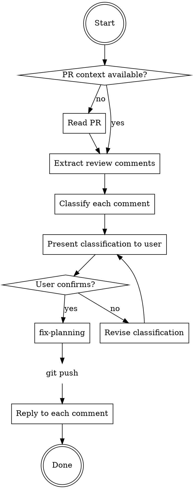
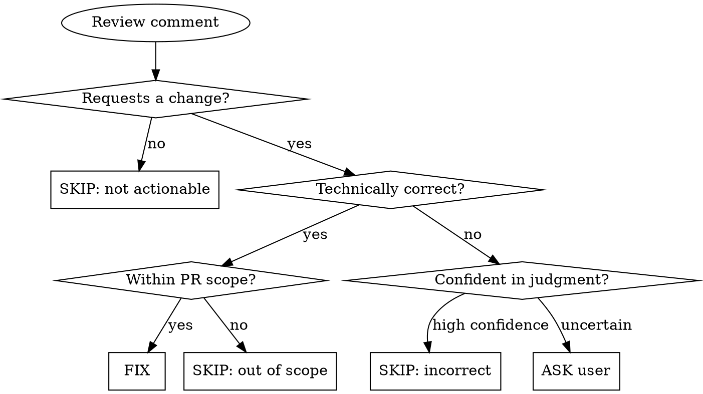

# Resolve PR Review

Process PR review comments: classify, fix, commit, push, and reply.

## When to Use

- User provides PR URL and says "處理 review"、"fix review comments"、"resolve comments"
- User has already read a PR and asks to handle the review feedback

## Workflow



## Step 1: Get PR Context

If PR context is not already available, trigger the existing PR reading capability to gather metadata, diff, review comments, and full file content.

## Step 2: Extract Review Comments

Collect all review comments (inline code comments and review-level comments). Ignore PR conversation comments that are not review feedback.

For each comment, record: `comment_id`, `author`, `file`, `line`, `body`, `in_reply_to` (thread context).

## Step 3: Classify Comments

For each review comment, classify into one of:

| Classification | Criteria | Action |
|---------------|----------|--------|
| ✅ FIX | Requests a change AND technically correct AND within PR scope | Add to fix list |
| ❌ SKIP | Not actionable, technically incorrect, OR out of PR scope | Add to skip list with reason |
| ❓ ASK | Cannot determine correctness, intent, or scope applicability | Present to user for decision |

### Classification Logic



**Judging correctness:** Verify against the actual codebase — check dependencies, existing patterns, compatibility requirements, and architectural decisions. Same principle as `receiving-code-review`: verify before acting, push back with evidence if wrong.

### Scope Check

A suggestion is **out of scope** when:
- PR description explicitly marks it as deferred (e.g., "非本次 scope"、"out of scope"、"follow-up")
- Code contains a TODO acknowledging the issue and deferring it
- The suggested change requires modifying files not touched by this PR
- The suggestion is a refactoring unrelated to the PR's stated objective

**Signals to check:** PR title, PR description, TODO/FIXME comments in the diff, task scope from linked Jira/issue.

## Step 4: Present Classification

Show the user a summary before proceeding:

```
📋 Review Comment 分類結果

✅ 預計修正（N 項）：
  1. [file:line] 簡述 comment 內容
  2. ...

❌ 預計跳過（M 項）：
  1. [file:line] 簡述 comment → 原因：...
  2. ...

❓ 需要確認（K 項）：
  1. [file:line] 簡述 comment → 不確定原因：...
  2. ...

請確認，或調整分類。
```

Wait for user confirmation. User can override any classification.

## Step 5: Fix

**REQUIRED SKILL:** Invoke `fix-planning` with the confirmed FIX items as findings.

`fix-planning` handles: dev principle loading, simple/complex routing, brainstorming for complex items, execution, and verification.

Track which comments map to which commit (from `fix-planning` output) for the reply step.

## Step 6: Push

```bash
git push
```

If push fails, report error and stop.

## Step 7: Reply to Comments

After push, reply to each review comment thread using `add_reply_to_pull_request_comment`.

**Language:** zh-TW. Technical terms stay English.

### Reply Format

**Fixed:**
> 已修正，[簡述改動]。（commit: `<short-hash>`）

**Skipped (incorrect/not applicable):**
> 此處保留現有實作，[具體技術原因]。

**Skipped (not actionable):**
No reply needed for praise/discussion comments.

### Reply Mechanism

Use `add_reply_to_pull_request_comment` to reply in the existing thread — NOT `add_comment_to_pending_review` (that's for creating new review comments).

## Common Mistakes

| Mistake | Fix |
|---------|-----|
| Implementing all comments without verifying correctness | Classify first, verify against codebase |
| Classifying technically-correct suggestions as FIX without checking scope | Check PR description, TODOs, and task boundary before classifying as FIX |
| Skipping without technical justification | Every SKIP needs a concrete reason |
| Replying before pushing | Push first, then reply with commit references |
| Creating new review comments instead of thread replies | Use `add_reply_to_pull_request_comment` for replies |
| Replying in English | Use zh-TW, keep technical terms in English |
| Proceeding without user confirmation on ASK items | Always wait for user decision on uncertain items |
| Bypassing fix-planning for complex fixes | Always invoke `fix-planning` — it handles complexity routing |

## Edge Cases

| Situation | Action |
|-----------|--------|
| Comment thread with multiple back-and-forth | Read full thread context before classifying |
| Comment references code outside the PR diff | Check the referenced code, classify based on full context |
| Conflicting comments from different reviewers | Flag as ASK, let user decide |
| All comments are praise/discussion | Report "所有 review comment 皆為討論性質，無需修正" and stop |
| Fix introduces new issues | Run existing tests before committing; if tests fail, report and stop |
