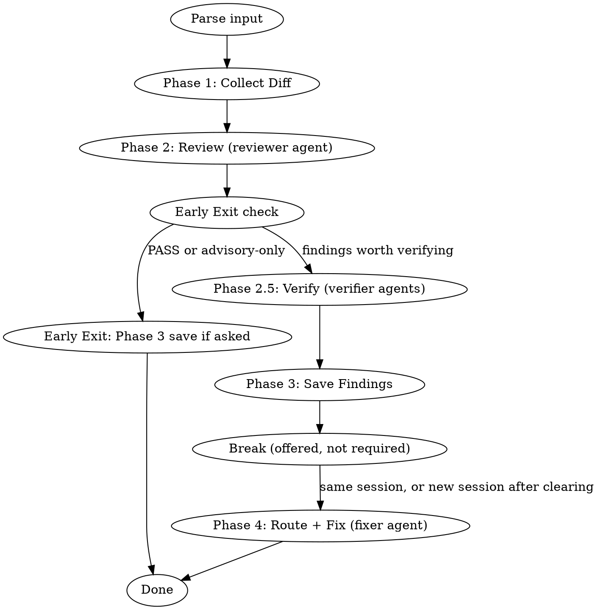

# Local Branch Review Workflow

## Overview

Orchestrator skill that reviews feature branch commits, saves findings, then drives the full fix cycle. The fix cycle may continue in the same session or resume in a fresh one after a context-clearing break — the break is offered after Phase 3, never required.

**Core principle:** Dispatch the review to an isolated `reviewer` agent, delegate each subsequent phase to its specialized skill, and hand the user a continuation prompt they may take or skip.

**Announce at start:** "I'm using the branch-review-workflow skill to review this branch."

## When to Use

- User asks to review a branch (e.g., "review branch site-management-t3")
- User asks to review current branch (e.g., "幫我 review 目前的 branch")
- User provides a commit range (e.g., "review 73a892658c..96b8f80152")
- User asks to continue a specific phase after clearing context

## Process



## Input Parsing

| User Input | Detection | Handling |
|------------|-----------|----------|
| Branch name | String without `..` | Branch-only commits via `git log <branch> ^origin/main` |
| Current branch | No args, or "current branch" | `git branch --show-current` → same as branch name |
| Commit range | Contains `..` | `git diff <start>..<end>` directly |
| Continue Phase N | Mentions "Phase" + number | Jump to that phase, read previous output file |

## Phase 1: Collect Diff & Resolve Branch Objective

For branch name / current branch input (commit range input skips to step 5):

1. Get branch-only commits: `git log --oneline --no-merges <branch> ^origin/main`
2. If 0 commits → report "沒有偵測到 branch-only commits" and stop
3. Extract oldest commit (last line of output) and newest commit (first line of output)
4. Determine range: `<oldest-commit>^..<newest-commit>`
5. Get changed file list: `git diff --name-only <range>`
6. Filter to current package scope (e.g., `packages/app-vsaas-portal/`)
7. If no changed files → report "沒有偵測到變更檔案" and stop

### Branch Objective Resolution

After collecting the diff, resolve the **branch objective** — a short statement describing what this branch is meant to accomplish. This is passed to the review engine to enable scope classification of findings, where the engine has that feature: `code-review` does, `spec-document-reviewer` does not.

**Priority order:**

1. **User-provided** (highest) — user states the objective when triggering review (e.g., "review current branch, 目標是開發使用者管理功能")
2. **External source** — the Jira issue, if user provides URL or key
3. **Branch name inference** — e.g., `feature/site-management` → "site management 功能開發"
4. **Early commit messages** — take the earliest 3 branch-only commits, **excluding** commits whose messages match fix/feedback patterns (`fix review`, `address feedback`, `fix:`, `chore: address`, etc.), and summarize into an objective

If no objective can be determined → review runs without scope filtering (all findings default to `in-scope`, preserving current behavior).

## Phase 2: Review

**REQUIRED AGENT:** dispatch the `reviewer` subagent. The review runs in an isolated
context — this session does not read the changed files itself.

Dispatch payload. Every row is required:

| Item | Value |
|------|-------|
| Role | From the changed-file list: `.js` / `.ts` / `.vue` → `frontend`; Go / infra / CI → `backend`; documentation, specs, requirements docs and operation manuals → `feature-doc`. More than one arm matches → one agent per matching role, each with its own procedure. No arm matches (a changeset of only styles, config or assets, say) → `frontend`, and record on the terminal output's role line that the role was defaulted rather than derived |
| Review procedure | The skill for the role: `frontend` → `~/.claude/skills/code-review/SKILL.md`; `backend` → `~/.claude/skills/backend-code-review/SKILL.md`; `feature-doc` → `~/.claude/skills/spec-document-reviewer/SKILL.md`. Its `references/*.md` resolve relative to that file |
| Procedure variant | When the procedure defines its own review roles, name the one you want. `spec-document-reviewer` has four (logic, ux, proofreading, technical-clarity) and `~/.claude/agents/reviewer.md` makes the agent default to logic and record the substitution under `Deviations` if the caller omits it — so leaving this out silently buys a logic review. `無` when the procedure has no variants |
| Skill directories | `~/.claude/skills/` and the repo's `.claude/skills/`, for the procedure's skill-discovery step |
| Review scope | The range from Phase 1, the filtered changed-file list, and the package path as cwd boundary |
| Branch objective | The objective resolved in Phase 1, or the literal `not provided` |
| Mode | For a diff-based engine (`code-review`, `backend-code-review`): `Local changes`, **with the range substituted for the working tree**. That procedure collects the file list via `git diff --name-only HEAD` and reads hunks via `git diff HEAD -- <file>`, and both are empty on a branch whose commits are landed and whose tree is clean — so the payload must say to read the range instead: `git diff --name-only <range> -- <package-path>` for the list, `git diff <range> -- <file>` for each file's hunks. Without this the agent reviews an empty diff and truthfully reports nothing. For a document engine (`spec-document-reviewer`) there is no mode: pass the changed documents' paths as the source, and the range only so the agent can see what the branch changed in them |
| Return | The procedure's complete findings block verbatim, plus its `Deviations` note if any |

The review skill named above is the analysis engine and owns the finding format. Dispatching
it into an agent changes where it runs, nothing else.

**Do NOT** re-implement review logic, and do NOT run the review engine in this session.

## Early Exit: No Findings

Runs **after Phase 2 and before Phase 2.5**. If Phase 2 returned `PASS — 未發現問題`, or only
findings at the engine's advisory severities (`LOW` for `code-review` and
`backend-code-review`; `Low` and `Recommend` for `spec-document-reviewer`):

1. Report review summary to user
2. Ask: "Review 完成，沒有需要修正的項目（或僅有低嚴重度建議）。是否要儲存 review 結果？"
   - Yes → Save findings via Phase 3, then **stop** (no Phase 4)
   - No → **Stop**

Checking here rather than after verification is what makes this an exit. Phase 2.5 dispatches
at most two agents, and a read-only agent costs on the order of 51k tokens before it does
anything — a ten-finding LOW-only review that verified first would pay for both dispatches and
then throw the verdicts away at a stop that costs nothing one phase earlier.

A review that exits here has no verdicts, so the file it saves has no `## Verification`
section and the terminal output omits its 驗證 line. Phase 3's frontmatter, Metadata and
Description rules apply unchanged — but NOT its Breakpoint subsection, whose continuation
prompt invites a session into Phase 4 and tells it to read a `## Verification` table this file
does not have.

**Per role.** When Phase 2 ran more than one role, this exit is decided per role, not for the
review. A role that returned `PASS` or advisory-only findings exits here and saves its own
file; a role that returned anything above advisory goes on to Phase 2.5 and through the rest
of the workflow with its own file. Say in the report which roles exited and which continued.
"Nothing to fix" is a statement about one role's findings, never about the branch, unless
every role exited.

**Do NOT proceed to Phase 4 (Route + Fix) for a role with nothing to fix.**

## Phase 2.5: Verify Findings

**REQUIRED AGENT:** dispatch the `verifier` subagent — **at most two dispatches for the whole
phase, whatever the finding count**. Fewer than four findings go to a single dispatch; four or
more are split across two, and the split is yours to decide. This is a ceiling, not a target:
it stops verification cost from growing with the number of findings, which is the one place in
this workflow that used to scale linearly. It is a separate agent type from Phase 2's
`reviewer` so the two stages stay tellable apart while they run.

**Splitting the two: keep findings that touch each other apart.** Two findings on the same
file — or on the same function, key, or symbol — go in *different* batches wherever the split
allows. A verifier that has just settled one claim about a piece of code carries that stance
into the next claim about the same code, and that is the one place batching can actually
corrupt a verdict; findings in unrelated files share no such surface. Splitting by file would
share a read and buy that saving at exactly the wrong place. Where more findings collide than
two batches can separate, spread them as evenly as two allow — the ceiling holds, and an even
spread is the most it can buy.

**Batches never cross roles.** The `Role` row sets the verifier's persona, and a batch has
one. A two-role review therefore lands as one dispatch per role, which is what the ceiling
already allows. If three roles matched, the role constraint wins and the phase takes three
dispatches: a finding judged in the wrong persona costs more than one extra dispatch.

Each verifier sees only the findings in its own batch, and never another batch's verdicts.

Dispatch payload, per dispatch. Every row is required:

| Item | Value |
|------|-------|
| Role | The role of the Phase 2 agent that produced these findings — Phase 2 may have run one agent per role, and a batch never mixes two |
| Review procedure | `~/.claude/skills/verify-findings/SKILL.md` |
| Review scope | The package path as cwd boundary, and the commit range Phase 1 resolved — a verifier told only which directory reads HEAD, which is the revision under review only while nothing lands between Phase 2 and here |
| Findings | The findings in THIS batch each verbatim: its `#`, its claim line, its location anchor, and **every field the engine emitted except the two withheld below**. For `code-review` that is `規則來源`, `修復參照`, `參考依據` and `導致問題`. State that each is judged on its own evidence, and that a verdict reached on one is not evidence about another |
| Withheld | The two fields that state **what the correct state should be** and **what the fix should be** — for `code-review`, `期望目標` and `建議修復`. A verifier shown the fix checks whether the fix looks reasonable instead of whether the claim is true; both fields read as the answer. Telling it not to evaluate the fix does not undo having shown it: the input has to be withheld, not annotated. An engine that emits no such fields withholds nothing. |
| Known-readable resources | What this session already knows is reachable in this environment and a fresh agent would not assume: the local package cache when a dependency's own source must be read, sibling packages inside this repo, and any tool invocable via `pnpm dlx` together with the directory it must be run from. This row lists **resources only** — never another agent's findings, verdicts or reasoning, which would break the isolation between verifiers. `無` when there is nothing beyond the package itself. |
| Return | The procedure's four labelled blocks **once per finding**, each set headed by that finding's `#`: `判定`, `實際讀到`, `無法從檔案判定的部分`, `理由`. Take the verdict from the `判定：` line and the fields under it; ignore any summary sentence or sources block the agent places around them — those are required of it by rules that outrank this procedure. A dispatch that returns fewer verdict sets than findings has not verified the rest: re-dispatch the missing ones, do not infer them. |

Collect one verdict per finding.

A dispatch that fails, or returns a verdict that cannot be parsed, is **not** `cannot tell`.
Phase 3 requires every `cannot tell` row to carry the verifier's `無法從檔案判定的部分` list,
and a dispatch that never produced output has no such list — the rule would be unsatisfiable
for it. Re-dispatch it once. If the second attempt also fails, record it as
`verification failed`: its own state, exempt from the `無法從檔案判定的部分` requirement, never
`upheld`, counted separately in the terminal output, and routed to the user in Phase 4a.

## Phase 3: Save Findings

**REQUIRED SKILL:** save via `analysis-context`. The findings file follows that skill's
frontmatter and its `## Metadata` and `## Description` sections, and **adds** sections this
workflow defines: `## Verification` below, and `## Reformulation Candidates` if Phase 4a
produces one. (A file saved through the Early Exit has neither — it verified nothing and never
reaches Phase 4a.) That is a declared divergence, not an oversight — `analysis-context`'s format
reference is a strict contract with a fixed section list, neither addition is in it, and this
workflow's template also omits its heading-and-source-line section. `analysis-context` is not
modified to accommodate any of this.

**One file per role.** A review that dispatched more than one role in Phase 2 saves ONE FILE
PER ROLE, each with its own `## Metadata`, its own `## Description`, its own `## Verification`
section and its own numbering. Do not merge two engines' output into one block: two agents
return two envelopes, two conclusions and two independent numberings, and there is no safe way
to renumber across them (see the `編號對應：` rule below). Phase 4a then routes each file's
findings independently.

Assemble each role's findings into markdown:

```yaml
---
source: branch-review
id: "{ref-name}"
url: ""
title: "Branch Review: {branch-name}"
fetched_at: "YYYY-MM-DD"
---
```

With more than one role, append the role to both: `id: "{ref-name}-{role}"` and
`title: "Branch Review: {branch-name} — {role}"`, so the two files are distinguishable
before they are opened.

Metadata section:

```markdown
## Metadata

| Field | Value |
|-------|-------|
| Branch | {branch-name} |
| Range | {start-commit}..{end-commit} |
| Role | {the Phase 2 role whose findings this file carries} |
| Files Reviewed | {count} |
| Findings | {the counts, in the engine's own severity vocabulary — `{N} CRITICAL, {N} HIGH, {N} MEDIUM, {N} LOW` for `code-review` and `backend-code-review`; `Critical / High / Medium / Low / Recommend` for `spec-document-reviewer`} |
| Verdict | {the engine's own concluding verdict} |
```

Append `（in-scope: {N}, out-of-scope: {N}）` to the `Findings` row **only when the engine
classified scope**. Scope classification is a `code-review` feature; `spec-document-reviewer`
has none, and inventing the two figures for it is worse than leaving them out.

Description section: the findings block the reviewer agent returned for this role.

Copy it; do not re-assemble it. What lands under `## Description` runs from the **first line
of what the agent returned to the last**, with nothing re-ordered, nothing dropped, and
nothing added. Where the transport escaped characters on the way back — `>` arriving as
`&gt;` is the usual one — un-escape them on write. That is the only permitted difference, and
it exists so the file reads as the agent wrote it.

(For `code-review` that span is concretely: the `━━━━━━━━━━━━ Code Review ━━━━━━━━━━━━`
banner, its `檢查檔案數 / 候選規則 / 實際套用 / Interface impact / Branch 目標` envelope, the
severity group headers, each finding's `{file}:{line}` anchor line with its `**欄名**：值`
fields in the engine's fixed order, the `※ 超出 branch 目標` marker on out-of-scope findings,
and the trailing `摘要` and `結論` lines. The envelope goes in because `候選規則`, `實際套用`
and `Interface impact` have no row in the Metadata table above, so it is the only place they
survive. Another engine has another anatomy — the rule above is the same for all of them.)

The engine owns this format. This phase transports it.

The verdicts from Phase 2.5 do NOT go inside that block. They go in their own section
after it:

```markdown
## Verification

編號對應：{how the `#` column maps to `## Description` — the engine's own identifiers where it
emits them (`1` = `C-1`, `2` = `H-1`, …), otherwise order of appearance, said explicitly}

| # | 判定 | 理由 |
|---|------|------|
| 1 | upheld | … |
| 2 | not upheld | … |
```

**The `編號對應：` line is required.** No engine guarantees a stable finding number:
`code-review` numbers `{n}.` within each severity group and restarts the count per group, and
`spec-document-reviewer` groups findings under severity headings and in practice prefixes them
`[C-1]` / `[H-1]`, but its skill file does not require it, and the findings it groups under
`### Cross-File Reconciliation` carry no identifier at all. The `#` column is always an ordinal the orchestrator assigns —
`1`, `2`, `3` — never the engine's own identifier pasted in. What the `編號對應：` line does is
map that ordinal onto whatever the engine gave: its identifiers where it emits them, and
otherwise order of appearance in `## Description`, said explicitly. One shape of table, whatever
the engine. The orchestrator assigns these numbers when it builds the table,
and the same numbers are what Phase 4a routes on and what Phase 4b's payload carries. A
mis-counted ordinal fixes a finding the verifier refuted, or drops one it upheld, and nothing
downstream can detect it — which is why the mapping is stated rather than assumed.

`## Description` stays what the reviewer returned, under the fidelity rule above. It begins at
the first line the agent returned — for `code-review` that is the banner, which is part of
what came back, not a title the `## Description` heading replaces — and ends at its last.
Reading the file then means matching numbers across two sections; that cost is accepted.

Every finding gets a row. Nothing is dropped, including `not upheld`.

For a `not upheld` or `cannot tell` row, the `理由` cell opens with what the verifier
reported under `實際讀到` — the content actually at the cited location — before the
reasoning. A verdict that takes a finding off the fix list is the one a reader needs
evidence for. `upheld` rows may omit it. This ordering is a convention of this workflow,
adopted for readability and never measured: a row that carries the same evidence in a
different order is compliant in substance, and the requirement is that the evidence be
there, not that it be first.

A `cannot tell` row also carries what the verifier listed under
`無法從檔案判定的部分`. That list IS the reason the verdict is undecided, and it is
exactly what a person needs in order to settle it — dropping it leaves a row that says
"we could not tell" without saying what would have told us.

A `verification failed` row has no verifier output to carry: its `理由` says what failed and
that the finding was re-dispatched once. It is exempt from both rules above, and it must not
be written as `cannot tell` — "never verified" and "verified, undecidable" look alike on the
page and route differently.

Save to `docs/context/branch-review-{ref-name}.md`, or, when Phase 2 ran more than one role,
to `docs/context/branch-review-{ref-name}-{role}.md` per role.

**The ref name.** `/` in a branch name becomes `-`: `jane/ADAT-924/fix-toggle` gives the file
`branch-review-jane-ADAT-924-fix-toggle.md`. This flattened string is the **ref name**, and it
is the same string Phase 4b's TODO ref tag carries — so a tag can be followed back to a file
that exists.

### Terminal Output

The terminal gets the summary, the file gets the findings. Do not print the findings.

```
Review 完成（reviewer agent）
角色：{role}{；defaulted 時註明「未匹配，預設 frontend」}
檢查檔案數：{N}    實際套用：{activated skills}
{嚴重度計數，用引擎自己的詞彙}    （in-scope {N} / out-of-scope {N}；引擎沒有分類就整段省略）
驗證：成立 {N} / 不成立 {N} / 查不出來 {N} / 驗證失敗 {N}
結論：{verdict}
Deviations：{agent 的 Deviations 註記；沒有就整行省略}
findings：docs/context/branch-review-{ref-name}.md（多角色時為 -{role}.md，見 Phase 3 的存檔規則）
```

When Phase 2 ran more than one role, print this block once per role, each naming its own
file — there is no combined block, for the same reason there is no combined file. A review
that took the Early Exit omits the 驗證 line entirely; it verified nothing. Omit any other
line the engine gives nothing for — `實際套用` is a `code-review` transparency line and a
document engine has no equivalent; an empty label is worse than an absent one.

### ⏸ Breakpoint (advisory)

Review no longer runs in this session, so the context pressure that made this break
mandatory is gone. Offer it, do not force it:

```
接下來可以直接進入 Phase 4，或清除 context 後貼上以下 prompt 繼續：
---
continue Phase 4 — 載入 review-workflow skill，讀 references/local-branch.md 的 Phase 4。
讀取 docs/context/branch-review-{ref-name}.md 作為 review findings；Phase 2 跑了不只一個
role 時每個檔案各自跑一次 Phase 4a，不要合併兩份的編號。
判定已經在檔案的 ## Verification 表裡，不要重驗；表開頭的「編號對應」說明 # 欄怎麼
對回 ## Description，依它對應，不要自己數；not upheld 的不進修復清單。
依 Phase 4a 的分流表決定每一項的去向——不要每一項都問我，只問表上「先問使用者」那一欄的。
要問的那些用 brainstorming 確認並產出 design doc；直接派工的那些 settled design 填 none。
接著依 Phase 4b 派 fixer agent 執行修正——不要在這個 session 自己動手改。
---
```

## Phase 4: Route + Fix

**Entry:** either route. Continuing in this session straight after Phase 3 is one entry;
a fresh session that pasted the Breakpoint's continuation prompt is the other. The break is
offered, not required, and a session that continued through it reads the findings file exactly
as a fresh one does.

### Phase 4a: Route

Run this once per findings file. Two files from a two-role review are routed independently,
and their numbering is never merged.

1. Read the findings file, both sections, and the `編號對應：` line above the `## Verification`
   table. Map every verdict row to its finding through that line — do not count rows.
2. **Settle before routing:**
   - `not upheld` → not fixed. It stays in the file; the user may pull it back.
     One exception in kind, not in verdict: when what the verifier reported under `實際讀到`
     establishes a fact that would support a **reformulated** version of the finding — the
     supporting detail was wrong, but what it was cited for now stands on better ground, not
     worse — do not let the better version die with the refuted one. Surface it to the user as
     a candidate and append it to the findings file under `## Reformulation Candidates`, with
     the fact the verifier established and the reformulated claim it supports. It does **not**
     go in the `## Verification` table: those `理由` cells are the verifier's words, and
     `verify-findings` forbids a verifier to raise a new finding, so nothing of the
     orchestrator's own belongs in them. A candidate the user accepts re-enters at step 3 as a
     new finding, with their decision as its settled design.
   - `cannot tell` → present to the user for a decision. Do not fix and do not
     silently skip it. One the user says to fix joins the "to the user first"
     group in step 3, carrying what they decided as its settled design; one they
     set aside is handled as `not upheld` from here on.
   - `verification failed` → present to the user the same way, saying plainly that the
     finding was never verified rather than that it was checked and found undecidable.
   - **No location on the branch** → recorded, not routed, whatever its verdict. A finding
     that cites nothing on the branch — a reviewer's note about its own coverage, a count of
     what it checked, a general observation — has nothing for a fixer to change. Say in the
     report that it was recorded and dropped, so the drop is visible rather than silent.
3. **Split what step 2 left — the in-scope `upheld` findings, plus any the user pulled back in
   from step 2 — by whether the fix changes behaviour.** Out-of-scope findings are **excluded
   from this split** and handled by step 5, whichever column they would otherwise have landed
   in: an out-of-scope documentation finding is still out-of-scope, and it becomes a TODO
   comment, not a fixer dispatch.

| Straight to the fixer | To the user first |
|---|---|
| Documentation, spec text, comments | Logic changes |
| JSDoc: adding one, or fixing one that is wrong | Public interface, or naming on an exposed API |
| Adding a test assertion that pins a premise the test already states | Changing what an existing assertion guarantees |
| | Cross-package coordination |
| | Structural or design changes |

   Route on this table and on nothing else. Needing to read a rule before the fix can
   be written and needing a human decision are different things: the fixer reads the
   rule itself, so a finding that cites one is not thereby a finding for the user.

   **A fix that lives in git history rather than in a file** belongs to neither column: a
   wrong or missing commit message, a commit's structure, anything no file edit can change.
   The fixer is forbidden to commit and therefore cannot execute it. **This session** handles
   those itself, because this session is the thing that commits. `code-review`'s checklist
   scores commit messages on this workflow's path, so this class is produced by design and
   needs a destination rather than an exception.

4. **REQUIRED SKILL:** for the "to the user first" group only, use `brainstorming`
   to confirm each one and produce a design.
5. **Out-of-scope findings** are handled in Phase 4b as TODO comments — never by the fixer,
   never by `brainstorming`.

### Phase 4b: Execute Fixes

**If the routed set is empty** — every finding dropped by verdict, dropped for having no
location on the branch, kept by this session as a history-only fix, or all of them
out-of-scope — do not dispatch a fixer. Insert the TODO comments below if there are
out-of-scope findings, do the history-only fixes yourself, report that nothing was sent to a
fixer and why, and stop.

**REQUIRED AGENT:** otherwise dispatch the `fixer` subagent. One fixer runs at a time —
never two concurrently, since findings routinely land in the same file. A single dispatch
may carry several findings.

The routed set does not go out as one dispatch. The "straight to the fixer" group is ready
the moment Phase 4a produces it; the "to the user first" group is not ready until step 4's
design exists. Dispatch the first group, then the second when its design lands. Waiting for
the second group before sending the first stalls work that needs no decision.

Dispatch payload, per dispatch. Every row is required:

| Item | Value |
|------|-------|
| Procedure | Inline, in the payload — there is no procedure file to load, and these three steps are the whole of it. **1. Before the first edit**, collect the file types across all findings and read the rules that govern WRITING them, not only the rules the findings were raised under: a changed `.js`, `.ts` or `.vue` always means `naming-conventions`, plus any skill in the directories below whose description covers writing or modifying those types. Read the rule sections, not the titles. **2. Fix each finding**, reading its `修復參照` section first. **3. Before returning**, re-read each finding against the change you made and confirm it is satisfied |
| Routing already settled | State it: routing was decided in Phase 4a and is not re-opened here — do not stop to plan, no `brainstorming`, no `writing-plans` |
| Commit | State that the fixer does not commit — this session does, after reading `需要決定`. The agent definition says so too; the row is carried anyway so it also binds a caller who supplies a different executor |
| Never `git stash` | State it outright: the executor must not run `git stash` in any form, including `git stash push` / `pop` / `-u`. In this environment many worktrees share one clone and therefore one stash stack, so a stash taken in an agent's worktree can capture or drop work belonging to another agent or to the caller. Uncommitted changes stay in the working tree; the caller owns them. This row is carried in the payload rather than left to the agent definition so it also binds a caller who supplies a different executor |
| Skill directories | `~/.claude/skills/` and the repo's `.claude/skills/` — where the Procedure's step 1 looks |
| Findings to fix | The findings in THIS dispatch, each with its `#` from the Verification table, its location, its claim, the rule the finding cites, and the section to read before fixing — where the engine names those as fields, pass the fields (for `code-review`: `規則來源` and `修復參照`). The `#` travels so the fixer's `變更` can be read back against the table without re-deriving which finding is which |
| Known-readable resources | The same row as Phase 2.5's: what this session already knows is reachable here and a fresh agent would not assume — the local package cache, sibling packages inside this repo, a tool invocable via `pnpm dlx` and the directory it must run from. Resources only, never another agent's findings or verdicts. `無` when there is nothing beyond the package itself |
| Settled design | The Phase 4a design doc, for a dispatch of findings that went through the user; the literal `none` for a dispatch of findings routed straight through |
| Scope | The package path as cwd boundary. A finding routed for cross-package coordination crosses it by definition: name every package its settled design covers, or the fixer cannot complete it |
| Return | The fixer's three labelled sections: `變更` (changes per finding), `測試` (the test result), and `需要決定` (every choice the fix left open, or the literal `無`) |

**Out-of-scope findings** → this session inserts the TODO comments itself, not the
fixer; they are not in the routed set. At the relevant locations:

```javascript
// TODO: <finding description> (ref: branch-review-{ref-name})
```

Use the comment syntax of the file being annotated, not this one. The `feature-doc` arm makes
`.md`, `.json` and `.yaml` files reachable, where `//` is not a comment: use `<!-- … -->` in
Markdown and a `#` line in YAML. JSON has no comment syntax — an out-of-scope finding on a
JSON file is reported in the terminal and recorded in the findings file, not annotated.

The tag carries the **ref name** Phase 3 defined — the branch name with every `/` flattened
to `-` — so the tag and the findings file name are the same string and a reader can follow one
to the other. Findings whose verdict is `not upheld` do not get a TODO. Commit them separately
as `chore: add TODO comments for out-of-scope review suggestions`.

After the fixer returns: report its changes, its test result, and its `需要決定`
list. **This session commits** — the fixer does not.

**Do NOT** fix anything in this session yourself, and do NOT let the fixer commit.

## Common Mistakes

| Mistake | Fix |
|---------|-----|
| Running the review engine (`code-review` / `backend-code-review` / `spec-document-reviewer`) in this session instead of dispatching the reviewer agent | Phase 2 dispatches — this session never reads the changed files, and never re-implements review logic either |
| Re-assembling the findings block when writing the findings file | It is a copy, not a rebuild: first line to last of what the agent returned, nothing re-ordered, dropped or added, transport escaping un-escaped on write |
| Printing the findings to the terminal | The terminal gets the summary and the path; the file carries the findings |
| Not offering the breakpoint, or forcing it | It is advisory since review moved to a subagent: offer the continuation prompt, and continue into Phase 4 in this session if the user prefers |
| Sending every finding through brainstorming | Only behaviour-changing fixes need the user; route on the Phase 4a table |
| Bypassing the fixer agent, manually fixing findings | Always dispatch the fixer agent — it loads the rules governing the file types it edits and validates each fix against its finding. Routing is Phase 4a's and is already decided before the fixer is dispatched |
| Proceeding to Phase 4 when review found no issues | Check the Phase 2 verdict before dispatching any verifier — if PASS or only advisory-severity findings, take the Early Exit, which sits between Phase 2 and Phase 2.5 |
| Verifying first and then taking the Early Exit | The exit runs before Phase 2.5; verifying an advisory-only review pays up to two dispatches for verdicts that are then discarded |
| Merging two roles' findings into one file or one numbering | One file per role, each with its own `## Verification` and its own numbering; Phase 4a routes them independently |
| Passing out-of-scope findings to brainstorming or the fixer | Out-of-scope findings become TODO comments in Phase 4b and never reach either; of the in-scope ones, only the "to the user first" group goes through brainstorming |
| Not passing branch objective to the review engine | Always pass the resolved objective so an engine that classifies scope can do it |
| Letting the fixer commit | The fixer reports; this session commits |
| Letting any dispatched agent `git stash` | Worktrees here share one stash stack; the payload forbids it and changes stay in the working tree |
| Fixing a finding whose verdict is not upheld | Verdicts gate the fix list; not upheld stays in the file unfixed |

## Boundaries

**This skill DOES:**
- Orchestrate the full review → fix workflow
- Offer a context-clearing break after Phase 3 — offer it, never require it — and generate the
  continuation prompt for a session that takes it

**This skill does NOT:**
- Perform code review directly (dispatches the `reviewer` agent, which runs the review engine)
- Verify findings itself (dispatches the `verifier` agent, at most two dispatches)
- Plan or execute fixes directly (dispatches the `fixer` agent)
- Load dev principles or validate individual fixes (the fixer does these)
