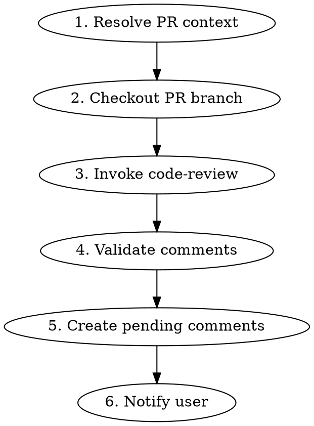

# PR Review Workflow

## Overview

Review a GitHub PR, produce findings via `code-review`, and post them as pending review comments. Ends after notification — no fix cycle.

**Announce at start:** "I'm using the review-workflow (PR review) skill to review this PR."

<HARD-GATE>
These rules are non-negotiable for ALL PR reviews.

1. Findings MUST be posted as pending review comments. No exceptions.
   - Each finding = one separate comment with line-level annotation.
   - Do NOT bundle multiple findings in one comment.
   - Do NOT output findings only to terminal when source is a GitHub PR.

2. NEVER submit the pending review. The user submits manually.
   - Do NOT call submit_pending.
   - Do NOT ask "要不要 submit?"
   - Do NOT offer to submit.

3. After creating the pending review, notify the user with the comment count and PR
   link. A zero-finding review is still created and still notified — see Early Exit.
   That is the terminal state. Stop.
</HARD-GATE>

## Process



## Step 1: Resolve PR Context

Use `github-pr` skill (or GitHub MCP tools directly) to gather:
- PR metadata (title, author, base, head, files changed)
- PR diff
- Existing review comments (to avoid duplicates)

## Step 2: Checkout PR Branch

**Goal:** Full local file access for enclosing-scope analysis, always at PR's latest commit.

**Determine remote:** PR refs (`pull/N/head`) live on the repo where the PR was opened (base repo). Identify the local remote pointing to `{base.repo.full_name}` from Step 1 metadata — `origin`, since branches and PRs both live in the org repo.

1. Check current branch: `git branch --show-current`
2. If already on PR branch:
   ```bash
   git fetch {remote} pull/{N}/head
   git reset --hard FETCH_HEAD
   ```
3. Otherwise:
   ```bash
   git fetch {remote} pull/{N}/head:pr-{N}
   git checkout pr-{N}
   ```
4. If fetch fails (permissions, network), fall back to API-only mode (diff from Step 1)

## Step 3: Invoke code-review

Delegate analysis entirely to `code-review` skill:
- `code-review` runs Steps 1–5 (classify files, discover skills, review, produce findings)
- `code-review` does NOT handle output — it returns structured findings
- Pass PR title as branch objective for scope classification

**Do NOT** re-implement review logic. `code-review` is the analysis engine.

## Step 4: Validate Comments

Load [post-review-validation.md](post-review-validation.md) and run V1–V4 checks on every finding before posting:

- V1: Line number correctness (re-derive from diff hunk header)
- V2: Rule applicability (skill matches file type)
- V3: Severity correctness
- V4: Language & format (zh-TW, no bundled issues)

Auto-fix or discard as defined in post-review-validation.

## Step 5: Create Pending Review Comments

1. Create a pending review: `pull_request_review_write` (method: `create`, NO `event` parameter)
2. For each validated finding, add a comment: `add_comment_to_pending_review`
   - One finding per comment
   - Line-level annotation via tool params: the finding's own anchor `{file}:{line}` → `path` / `line` / `startLine` / `side`. NOT repeated in body.
   - **Body = code-review's finding block, verbatim.** Take that finding's block from code-review's Step 6 output and use it as the comment body, prefixed with a severity tag. Do NOT reformat, reorder, drop, or rename fields.

     Body layout (per finding):

     ```
     [{severity}] [{category}] {issue description}
     **規則來源**：{skill name}
     **修復參照**：{skill name} → {section}
     **參考依據**：{file}:{line} — {實際讀到的內容}
     **導致問題**：{what this causes}
     **期望目標**：{what the correct state should be}
     **建議修復**：{tiered strategy}
     ```

   - Empty fields keep their label using code-review's degraded form (e.g. `**修復參照**：N/A`).
   - Report-envelope lines never go in a body: `檢查檔案數 / 候選規則 / 實際套用 / Interface impact / 摘要 / 結論`, nor the `CRITICAL/HIGH/MEDIUM/LOW` group headers — severity is carried by the per-comment `[{severity}]` tag.

**Reminder:** Do NOT pass `event` to the create call. Do NOT call `submit_pending`.

## Step 6: Notify User

Output notification:

```
Pending review 已建立，共 {N} 筆 comments。

驗證結果：
  ✅ 通過：{N} 筆
  🔧 自動修正：{N} 筆
  🗑️ 丟棄：{N} 筆（規則不適用）
  ⚠️ 需人工檢查：{N} 筆

請到 GitHub 預覽並 submit：
https://github.com/{owner}/{repo}/pull/{pr_number}
```

When all comments pass with zero fixes/discards/flags, simplify:

```
Pending review 已建立，共 {N} 筆 comments。
請到 GitHub 預覽並 submit：
https://github.com/{owner}/{repo}/pull/{pr_number}
```

**This is the terminal state. STOP here.**

## Early Exit: No Findings

If `code-review` produces zero findings or verdict is `PASS — 未發現問題`, the review still
lands on the PR — as a body with no pins, for the user to approve.

1. Create a pending review carrying only a body: `pull_request_review_write`
   (method: `create`, NO `event`, `body` set). Body:

   ```
   Review 完成，未發現問題。

   檢查檔案數：{N}
   實際套用：{activated skills}
   ```

2. Add NO comments. A zero-finding review is a body, not a pin.
3. Notify the user, then stop:

   ```
   Review 完成，未發現問題。已建立 pending review（無 comment），請到 GitHub approve：
   https://github.com/{owner}/{repo}/pull/{pr_number}
   ```

**Why not just report to the terminal:** the review is still waiting on a decision only the
user can make, and a pending review is what makes that visible on the PR — and what the Stop
hook watches for to notify. A terminal-only report leaves no trace anywhere.

**Reminder:** the HARD-GATE holds unchanged here — do NOT pass `event`, do NOT call
`submit_pending`. The approve is the user's.

## Common Mistakes

| Mistake | Fix |
|---------|-----|
| Submitting the pending review | NEVER submit. User does this manually. |
| Outputting findings to terminal instead of PR comments | HARD-GATE: findings MUST be posted as pending comments |
| Skipping fetch when already on PR branch | Always fetch latest PR ref and reset, even if already on branch |
| Skipping checkout, reviewing with API diff only | Always attempt local checkout first for full file access |
| Re-implementing review logic | Delegate entirely to code-review |
| Bundling multiple findings in one comment | One finding = one comment |
| Asking user whether to submit | Do NOT ask. Just notify and stop. |
| Skipping post-review-validation | Always validate before posting |
| Reporting "no findings" to the terminal only | A zero-finding review still creates a pending review carrying the body alone — the user approves it |
