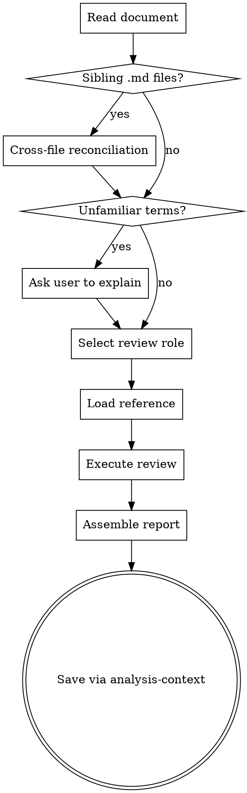

# Spec Document Reviewer

Review product feature specifications from a focused perspective. One role per invocation, strict senior reviewer stance.

## Execution Flow



## Dispatch Table

| Step | Action | Reference |
|------|--------|-----------|
| 1. Read document | Confluence URL → use confluence skill. Markdown path → read file. Already in conversation → use directly. | — |
| 1b. Cross-file reconciliation | If document comes from a file path, scan for sibling `.md` files and run reconciliation checks. Skip silently if no siblings or if source is Confluence URL. | See "Cross-File Reconciliation" section below |
| 2. Domain terms | Scan for unfamiliar domain-specific terms or jargon. If found, list them and ask user to explain before proceeding. | — |
| 3. Select role | If user already specified a role, use it. Otherwise prompt user to choose one role. | — |
| 4. Load reference | Load the corresponding reference file | See table below |
| 5. Execute review | Follow the loaded reference's checklist and persona | Loaded reference |
| 6. Output report | Assemble report per Output Format section below. Reconciliation findings merge into report under a dedicated heading. Always save via analysis-context — do not ask user for confirmation. | — |

### Role → Reference Mapping

| Choice | Role | Reference File | Slug |
|--------|------|----------------|------|
| 1 | Logic Review | references/logic-review.md | `logic` |
| 2 | Technical Clarity Review | references/technical-clarity-review.md | `technical-clarity` |
| 3 | UX Review | references/ux-review.md | `ux` |
| 4 | Proofreading Review | references/proofreading-review.md | `proofreading` |

## Review Stance

Strict senior reviewer. Challenge design decisions. Flag potential risks. Prefer over-reporting to under-reporting. This is NOT a rubber stamp.

## Severity Levels

| Level | Meaning |
|-------|---------|
| Critical | Blocks implementation or causes incorrect behavior if built as-is |
| High | Significant gap that will likely cause rework or misunderstanding |
| Medium | Notable issue that should be addressed but won't block progress |
| Low | Minor issue, low impact but worth fixing |
| Recommend | Not a problem — advisory suggestion for improvement |

Omit severity levels that have no findings.

## Cross-File Reconciliation

Automatic check that runs when the reviewed document has sibling `.md` files. Catches factual disagreements between files that describe the same entities from different angles (summary vs detail, task list vs specification).

**Trigger**: Document comes from a file path (not Confluence URL), and sibling `.md` files exist within 2 directory levels up + 2 levels down from the document's directory.

**Skip**: No sibling `.md` files found → skip silently.

### Procedure

1. **Discover and read siblings**: Scan 2 levels up + 2 levels down for `.md` files. Read all discovered siblings.

2. **Identify summary-detail relationships**: Find where the reviewed document references or summarizes content from a sibling (by section name, file name, entity name, or structural correspondence like task numbering matching spec sections).

3. **For each relationship, run three checks**:

   **a. Count reconciliation**: Extract numeric claims ("N items", "replace N", "N values", "N hardcoded"). Locate the corresponding content in the sibling. Count actual items listed. Flag if counts don't match.

   **b. Coverage reconciliation**: List all items in the detail side. Verify each is accounted for in the summary side (explicitly mentioned or covered by a grouping statement). Flag items present in detail but absent from summary.

   **c. Identifier format consistency**: For each replacement described in the document, extract two things: (1) the **target file extension** (e.g., `.js`, `.vue`, `.less`) and (2) the **identifier prefix** used (`@` = Less, `--` = CSS custom property, `$` = SCSS). Verify the prefix matches the target:
   - `.js` / `.ts` files → must use `--color-*` (CSS custom property), NOT `@color-*`
   - `.vue` `<style lang="less">` blocks → must use `@color-*` (Less variable)
   - `.vue` `<script>` blocks / JS logic → must use `--color-*` (CSS custom property)
   - `.less` files → must use `@color-*` (Less variable)
   - `.scss` files → must use `$color-*` (SCSS variable)

   Flag even if surrounding text says "equivalent" or "via CSS variable" — the identifier itself must use the correct prefix for the target file type.

   Example: A spec says `#333333 → @color-surface04 equivalent via CSS variable` for `DragPreviewRenderer.js`. The target is `.js` but the identifier uses `@` (Less prefix). Flag as HIGH — should be `--color-surface04`.

4. **Output**: Each mismatch → **HIGH** severity finding, grouped under `### Cross-File Reconciliation` in the report regardless of selected review role.

   ```
   **[HIGH]** {description}
   - 文件 A：{file} — {what it claims}
   - 文件 B：{file} — {what it actually contains}
   - 差異：{specific discrepancy}
   ```

## Output Format

Each finding: **location** (section/paragraph) + **description** (what's wrong) + **suggestion** (how to fix).

Report follows analysis-context schema. Title format: `{Document Title} — {Role Name}`.

Frontmatter `source` field: use the original source type (`confluence`, `markdown`, or `other`).

Frontmatter `slug` field (required): `{document-slug}-{role-slug}`.
- `document-slug`: extract meaningful English keywords from document title, lowercase, hyphen-separated (e.g., "Pre-bundle tool 程序優化" → `pre-bundle-tool`)
- `role-slug`: from the Role → Reference Mapping table above
- Example: `pre-bundle-tool-technical-clarity`

Metadata table must include a `Severity Summary` row (e.g., `Critical: 1, High: 2, Medium: 3`).

Group findings under severity-level headings (### Critical, ### High, etc.). Omit empty levels.

## Same-Session Optimization

If the user runs multiple roles in the same session, recognize the document is already in conversation — skip re-reading. Domain term clarification also carries over.
