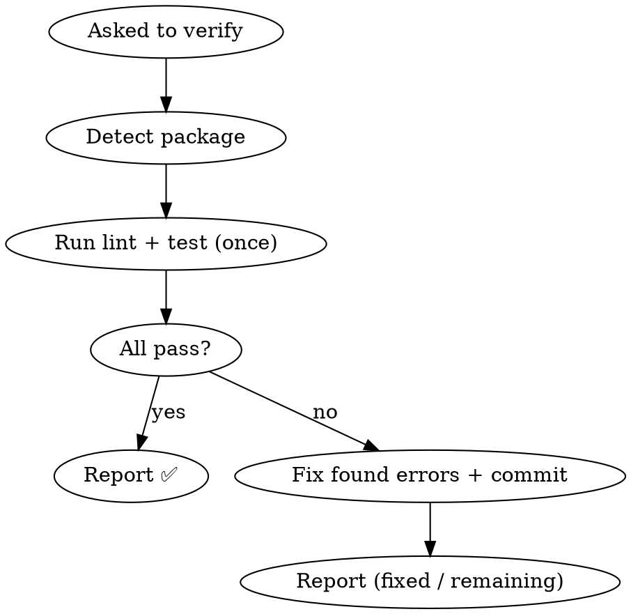

# Verify Package

## Overview

On-demand verification tool. When you ask for it, it runs the package's lint
and unit tests once, fixes any errors it finds, commits the fix, and reports
results. You decide what to do next — including whether to push.

**Core principle:** Verification is triggered explicitly. It never runs itself
and never gates `git push`.

## When to Use

Invoke only when the user explicitly asks to verify a package, e.g.:
- "verify this package" / "跑一下 lint + test" / "run verification"
- Before a push *if the user chooses to* — never automatically

This skill does NOT:
- Trigger on `git push`
- Get auto-invoked by other skills, workflows, or MCP servers
- Block or gate any push

## Process



## Step 1: Detect Package

1. Find nearest `package.json` from current working directory
2. Read `name` field → use for `pnpm --filter <name>`
3. Read `scripts` field:
   - Has `lint` → will run lint
   - Has `test:unit` → will run `test:unit --run`
   - Missing either → skip that check, warn the user

## Step 2: Run Verification (Single Pass)

1. **Run lint:** `pnpm --filter <package-name> lint`
2. **Run test:** `pnpm --filter <package-name> test:unit --run`
3. **Evaluate:**
   - Both pass → report ✅
   - Any failure → fix the found errors, commit, report

### Fix Behavior

- **Lint:** if `--fix` is available, run it first, then fix remaining errors manually.
- **Test:** fix the source code causing the failure. Do NOT modify test files unless the test is clearly wrong.
- **After fixing:**
  ```bash
  git add -A
  git commit -m "fix: resolve lint/test errors"
  ```
- **Single pass — no loop.** After one fix attempt, report. If errors remain,
  list them and let the user decide. The user can re-run this skill to confirm.

## Step 3: Result

- **All pass:** report ✅ with counts.
- **Fixed:** report what was fixed and current status; note that the user can
  re-run to confirm.
- **Still failing after the fix attempt:** report remaining errors. Let the user handle them.

You decide whether to `git push` — this skill does not.

## Boundaries

**This skill DOES:**
- Run lint + test on demand (single pass)
- Fix errors it finds, once, and commit
- Report results

**This skill does NOT:**
- Trigger on `git push` or gate any push
- Get auto-invoked by other skills
- Loop multiple rounds
- Modify test files (unless a test is clearly wrong)

**Related:** `verification-before-completion` handles "don't claim success
without evidence" — a separate concern, not invoked from here.
