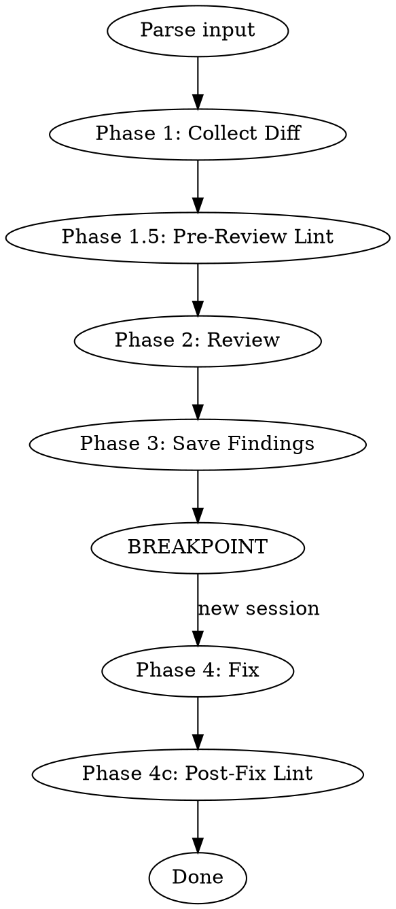
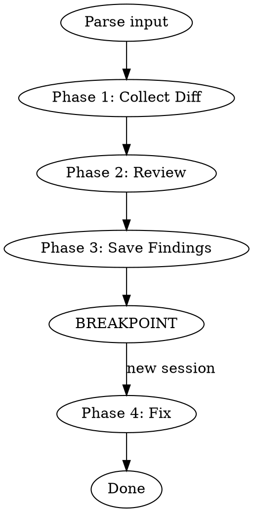
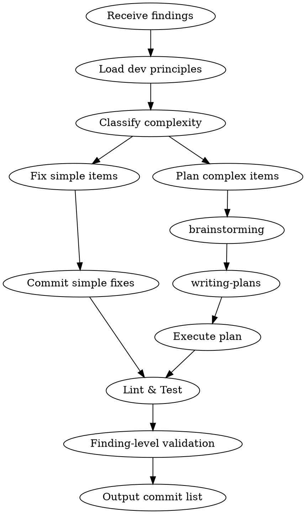
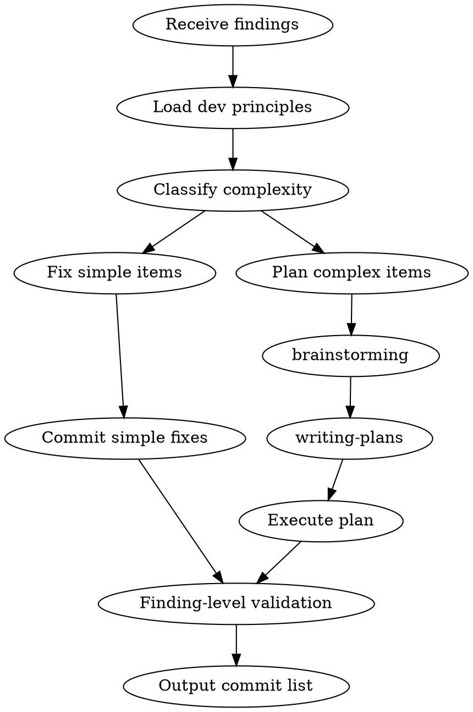

# Remove Auto lint/test from review-workflow and fix-planning — Implementation Plan

> **For agentic workers:** REQUIRED SUB-SKILL: Use `superpowers:subagent-driven-development` (recommended) or `superpowers:executing-plans` to implement this plan task-by-task. Steps use checkbox (`- [ ]`) syntax for tracking.

**Goal:** Delete all automated lint/test verification commands and auto-fix loops from `review-workflow/references/local-branch.md` (Phase 1.5, Phase 4c, Phase 4b tail) and `fix-planning/SKILL.md` (Step 5a), so that lint/test verification is triggered **only** by the user through `shared-verification` at `git push` time.

**Architecture:** Pure markdown edits to two skill files. No source code, no automated tests, no git commits (`~/.claude` is not a git repository). Each Task is a series of `Edit` calls against one file, followed by a grep-based validation Task that confirms the scope.

**Tech Stack:** `Edit` tool for surgical string replacement; `Bash` (`grep`) for post-edit validation.

**Spec:** `~/.claude/skills/shared-verification/docs/specs/2026-06-04-remove-auto-lint-test-design.md`

---

## File Structure

| File | Action | Reason |
|------|--------|--------|
| `~/.claude/skills/review-workflow/references/local-branch.md` | Modify | Remove Phase 1.5, Phase 4c, Phase 4b tail clause, 4 Common Mistakes rows; trim digraph |
| `~/.claude/skills/fix-planning/SKILL.md` | Modify | Remove Step 5a, collapse Step 5 heading, rewrite 3 Common Mistakes rows; trim digraph |

No file is created or deleted. All other skill files (`shared-verification/SKILL.md`, `code-review/SKILL.md`, `branch-workflow/SKILL.md`) must remain byte-identical.

---

### Task 1: Edit `review-workflow/references/local-branch.md`

**Files:**
- Modify: `~/.claude/skills/review-workflow/references/local-branch.md`

This file currently has 238 lines. The edits below MUST be applied in order — later edits assume earlier edits have already shrunk the file.

- [ ] **Step 1.1: Trim the process digraph (spec §A1)**

Use `Edit` with `old_string`:

````

````

`new_string`:

````

````

- [ ] **Step 1.2: Delete the entire `Phase 1.5: Pre-Review Lint Check` section (spec §A2)**

Anchor on the next section's heading so the deletion is unambiguous. Use `Edit` with `old_string`:

```
## Phase 1.5: Pre-Review Lint Check

Run eslint on branch-changed files before code-review to catch lint errors early.

1. Filter changed files from Phase 1 to `.js` and `.vue` only
2. Run: `npx eslint --fix <file1> <file2> ...`
3. If files were modified → `git add -A && git commit -m "style: auto-fix eslint errors"`; no changes → skip silently
4. Run: `npx eslint <file1> <file2> ...`
5. Parse output — ignore warnings, only process errors:
   - `import/no-cycle` → **CRITICAL** finding
   - All other eslint errors → **HIGH** finding
6. Format each error as a finding:
   ```
   [{severity}] [eslint] {rule-name}: {message}
   {file}:{line}
   規則來源：eslint → {rule-name}
   修復參照：N/A
   問題原因：eslint error
   期望目標：通過 eslint 檢查
   建議修復：依 eslint 錯誤訊息修正
   ```
7. Merge lint findings into Phase 2 code-review findings (they flow through Phase 3 → Phase 4 like any other finding)
8. No errors → continue without impact

## Phase 2: Review
```

`new_string`:

```
## Phase 2: Review
```

- [ ] **Step 1.3: Trim the Phase 4b tail clause (spec §A4)**

Use `Edit` with `old_string`:

```
**If all findings are out-of-scope:** skip Phase 4a and `fix-planning`, only insert TODOs (step 2), then run verification (lint + test).
```

`new_string`:

```
**If all findings are out-of-scope:** skip Phase 4a and `fix-planning`, only insert TODOs (step 2).
```

- [ ] **Step 1.4: Delete the entire `Phase 4c: Post-Fix Lint Verification` section (spec §A3)**

Anchor on `## Common Mistakes` to make the deletion unambiguous. Use `Edit` with `old_string`:

```
### Phase 4c: Post-Fix Lint Verification

After Phase 4b completes, run full package lint to ensure no lint errors remain.

1. Detect package: find nearest `package.json`, read `name` field
2. Run: `pnpm --filter <package-name> lint`
3. If errors exist → auto-fix loop (max 3 rounds), same as `shared-verification`:
   - Fix errors, `git add -A && git commit -m "fix: resolve lint errors (round N)"`
   - Re-run lint
   - After 3 failed rounds → block and report remaining errors
4. All pass → proceed

## Common Mistakes
```

`new_string`:

```
## Common Mistakes
```

- [ ] **Step 1.5: Remove four rows from the Common Mistakes table (spec §A5)**

The four rows are contiguous in the table. Use `Edit` with `old_string`:

```
| Claiming eslint/tests pass without running them | fix-planning uses verification-before-completion — evidence before claims |
| Skipping Phase 1.5 pre-review lint | Always run eslint on changed files before code-review — catches lint errors early |
| Skipping Phase 4c post-fix lint | Always run full package lint after fix-planning completes — ensures no lint errors remain |
| Including eslint warnings in findings | Only eslint errors become findings; warnings are ignored |
```

`new_string`: *(empty string — delete these four lines entirely)*

- [ ] **Step 1.6: Verify File A scope** — Read the modified file, confirm:

  - Section headings now read: `## Phase 1: …` → `## Phase 2: Review` → `## Phase 3: Save Findings` → `## Phase 4: Fix` (no Phase 1.5 / Phase 4c).
  - Phase 4b's "If all findings are out-of-scope" sentence ends in a period after `(step 2)`.
  - Common Mistakes table no longer mentions `eslint`, `Phase 1.5`, `Phase 4c`, or "Claiming eslint/tests pass".
  - The remaining rows of the Common Mistakes table (about delegation, breakpoint, brainstorming, scope-splitting, branch objective) are untouched.
  - Phase numbering is consecutive (1, 2, 3, 4) — no renumbering needed because Phase 1.5 and 4c were always sub-numbered.

If any of those statements is false, stop and re-check the previous Edit calls.

---

### Task 2: Edit `fix-planning/SKILL.md`

**Files:**
- Modify: `~/.claude/skills/fix-planning/SKILL.md`

This file currently has 131 lines. Edits in order.

- [ ] **Step 2.1: Trim the process digraph (spec §B1)**

Use `Edit` with `old_string`:

````

````

`new_string`:

````

````

- [ ] **Step 2.2: Collapse Step 5 — remove 5a, promote 5b (spec §B2)**

Use `Edit` with `old_string` (the entire current Step 5 block, anchored from the heading down to just before `## Step 6`):

````
## Step 5: Verify

### 5a: Lint & Test

**REQUIRED SKILL:** Use `verification-before-completion`.

```bash
pnpm --filter <package> lint
pnpm --filter <package> test
```

If failures → report errors, invoke `systematic-debugging` if needed. Do NOT claim success without evidence.

### 5b: Finding-Level Validation

After lint/test pass, **re-read each original finding** and verify the fix is semantically correct:

- Does the fix match the finding's suggested fix or intent?
- Does the fix comply with the referenced skill's rules (e.g., if finding says "bare `Array<Object>` violates jsdoc rule", is the replacement type actually specific)?
- Did the fix introduce new issues in the same area?

If any finding is not properly addressed → fix it before proceeding. This step catches "modified but not correctly fixed" issues that lint/test cannot detect.
````

`new_string`:

```
## Step 5: Finding-Level Validation

Re-read each original finding and verify the fix is semantically correct:

- Does the fix match the finding's suggested fix or intent?
- Does the fix comply with the referenced skill's rules (e.g., if finding says "bare `Array<Object>` violates jsdoc rule", is the replacement type actually specific)?
- Did the fix introduce new issues in the same area?

If any finding is not properly addressed → fix it before proceeding.
```

Two trailing-clause changes baked into the new content above:
- The leading "After lint/test pass," is removed (spec §B2 — no longer accurate).
- The trailing sentence "This step catches 'modified but not correctly fixed' issues that lint/test cannot detect." is removed (spec §B2 — comparison target gone).

- [ ] **Step 2.3: Remove two rows and rewrite one row in the Common Mistakes table (spec §B4)**

The three rows are contiguous in the existing table. Use `Edit` with `old_string`:

```
| Skipping verification | Always run lint + test with evidence |
| Claiming success without command output | Use verification-before-completion |
| Only running lint/test without checking fix correctness | After lint/test, re-read each finding and verify the fix matches the intent |
```

`new_string`:

```
| Skipping finding-level validation | Re-read each finding and verify the fix matches the intent before reporting done |
```

(Net effect: 3 rows in → 1 row out. The two "Skipping verification" / "Claiming success" rows are gone; the "Only running lint/test…" row is replaced with "Skipping finding-level validation…".)

- [ ] **Step 2.4: Verify File B scope** — Read the modified file, confirm:

  - There is exactly one `## Step 5` heading and it reads `## Step 5: Finding-Level Validation`.
  - There are no `### 5a` or `### 5b` subheadings remaining.
  - Step 6 heading and content are unchanged (`## Step 6: Output` and its body).
  - The Boundaries section (`## Boundaries`) is unchanged — `DOES: Orchestrate fix → commit → verify` line still present (spec §B5).
  - Common Mistakes table contains the new "Skipping finding-level validation" row and no longer contains the three removed rows.
  - The remaining Common Mistakes rows ("Skipping dev principle loading", "Treating cross-file logic change as simple", "Treating rule-dependent fix as simple", "Running brainstorming for typo fixes", "Simple fixes ignoring loaded dev principles") are untouched.

If any of those statements is false, stop and re-check the previous Edit calls.

---

### Task 3: Run scope-validation greps

**Files:**
- Read-only: both modified files plus three control files that must remain byte-identical.

These greps confirm the design intent (consolidation under `shared-verification`) actually held. They also catch verification-command variants the spec's narrower grep would have missed.

- [ ] **Step 3.1: Verify zero verification commands remain in the two edited skills**

Run:

```bash
grep -rnE "pnpm[[:space:]]+(--filter[[:space:]]+\S+[[:space:]]+)?(lint|test)|npx[[:space:]]+eslint|vitest|eslint[[:space:]]+--fix|eslint[[:space:]]+\S+\.(js|ts|vue)" \
  ~/.claude/skills/review-workflow \
  ~/.claude/skills/fix-planning
```

Expected: **zero** matches. (Mentions of the *word* "lint" inside narrative prose like "Skipping finding-level validation" are fine — only command-line invocations count.)

If any match appears, the corresponding Edit was incomplete. Inspect each hit and either remove it or document why it must stay.

- [ ] **Step 3.2: Verify removed sections are gone**

Run:

```bash
grep -nE "^## Phase 1\.5|^### Phase 4c|^### 5a|^### 5b" \
  ~/.claude/skills/review-workflow/references/local-branch.md \
  ~/.claude/skills/fix-planning/SKILL.md
```

Expected: **zero** matches.

- [ ] **Step 3.3: Verify Step 5 heading consolidated**

Run:

```bash
grep -cE "^## Step 5:" ~/.claude/skills/fix-planning/SKILL.md
```

Expected output: `1` (single match — the consolidated `## Step 5: Finding-Level Validation`).

Then confirm the heading text:

```bash
grep -nE "^## Step 5:" ~/.claude/skills/fix-planning/SKILL.md
```

Expected output: a single line ending with `## Step 5: Finding-Level Validation`.

- [ ] **Step 3.4: Verify control files were not touched**

For each of the three control files, read mtime and compare against a reference snapshot taken **before** Task 1 began. (If no pre-snapshot was taken, fall back to spot-checking critical lines.)

```bash
stat -f "%Sm %N" \
  ~/.claude/skills/shared-verification/SKILL.md \
  ~/.claude/skills/code-review/SKILL.md \
  ~/.claude/skills/branch-workflow/SKILL.md
```

If any of those mtimes is newer than the start of Task 1, an unintended write happened — investigate immediately.

Spot-check fallback (if no pre-snapshot):

```bash
grep -n "shared-verification" ~/.claude/skills/branch-workflow/SKILL.md | head -3
grep -nE "Boundaries|does NOT" ~/.claude/skills/code-review/SKILL.md | head -5
```

Both should reflect the pre-existing content described in the spec (`branch-workflow` line ~123 delegates to `shared-verification`; `code-review` Boundaries declares it does not run linters).

---

## Out-of-scope reminders (do NOT do these)

- Do **not** add cross-references in `review-workflow` or `fix-planning` Boundaries pointing at `shared-verification`. Spec §"Future extensions" defers this.
- Do **not** add an end-of-flow reminder line to `fix-planning` Step 6 output. Spec §"Future extensions" rejected this (Approach C).
- Do **not** modify `shared-verification/SKILL.md`, `code-review/SKILL.md`, or `branch-workflow/SKILL.md`.
- Do **not** create git commits — `~/.claude` is not a git repository.
