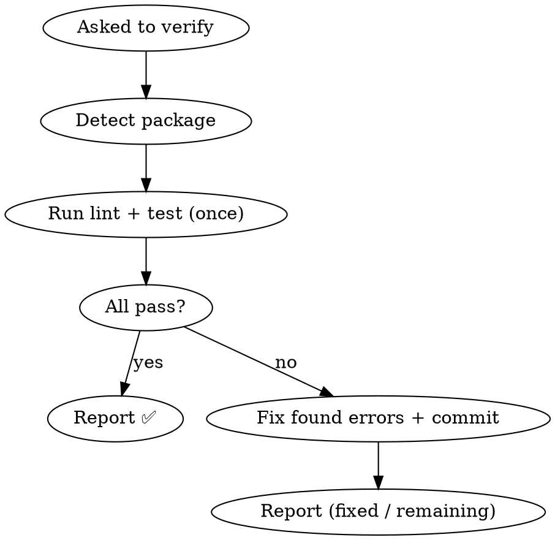

# Make Verification Manual (`shared-verification` → `verify-package`) Implementation Plan

> **For agentic workers:** REQUIRED SUB-SKILL: Use superpowers:subagent-driven-development (recommended) or superpowers:executing-plans to implement this plan task-by-task. Steps use checkbox (`- [ ]`) syntax for tracking.

**Goal:** Convert the mandatory, auto-triggered pre-push gate `shared-verification` into a manual, on-demand verification tool renamed `verify-package`, and remove the one live skill that references it by slug.

**Architecture:** Three edits — (1) rename the skill directory, (2) full-rewrite its SKILL.md into a manual single-pass tool, (3) delete one now-false integration line in `branch-workflow`. No hooks, no reminders elsewhere. Decoupling is achieved because after the change no live SKILL.md references the slug or auto-triggers the tool.

**Tech Stack:** Claude Code skill markdown files under `~/.claude/skills/`. No build, no test framework — verification is `ls` / `grep` against the spec's acceptance criteria.

**Important environment note:** `~/.claude` is **NOT a git repository**. Do **not** run `git add` / `git commit` for these files — those commands will fail. Each task ends with a verification command instead of a commit.

**Spec:** `2026-06-15-make-verification-manual-design.md` (same `docs/specs/` directory; moves with the rename in Task 1).

---

### Task 1: Rename the skill directory

**Files:**
- Move: `~/.claude/skills/shared-verification/` → `~/.claude/skills/verify-package/`

The `docs/` subtree (this plan, the 2026-06-15 spec, and the historical 2026-06-04 spec/plan) moves with the directory.

- [ ] **Step 1: Confirm the source exists and the target does not**

Run:
```bash
ls -d ~/.claude/skills/shared-verification && ! ls -d ~/.claude/skills/verify-package 2>/dev/null && echo "OK to rename"
```
Expected: prints the `shared-verification` path then `OK to rename` (the target must not already exist).

- [ ] **Step 2: Rename the directory**

Run:
```bash
mv ~/.claude/skills/shared-verification ~/.claude/skills/verify-package
```
Expected: no output (success).

- [ ] **Step 3: Verify the rename**

Run:
```bash
ls ~/.claude/skills/verify-package/SKILL.md && ! ls ~/.claude/skills/shared-verification 2>/dev/null && echo "RENAMED"
```
Expected: prints the SKILL.md path then `RENAMED`. The old directory no longer exists.

---

### Task 2: Rewrite `verify-package/SKILL.md` as a manual tool

**Files:**
- Modify (full rewrite): `~/.claude/skills/verify-package/SKILL.md`

- [ ] **Step 1: Overwrite the file with the manual-tool content**

Write the following exact content to `~/.claude/skills/verify-package/SKILL.md`:

````markdown
---
name: verify-package
description: Use when the user explicitly asks to run lint + unit-test verification on a package. Runs lint and unit tests once, fixes any errors it finds, and reports results. Manual / on-demand only — never runs automatically and never blocks pushing.
---

# Verify Package

## Overview

On-demand verification tool. When you ask for it, it runs the package's lint
and unit tests once, fixes any errors it finds, commits the fix, and reports
results. You decide what to do next — including whether to push.

**Core principle:** Verification is triggered explicitly. It never runs itself
and never gates `git push`.

## When to Use

Invoke only when the user explicitly asks to verify a package, e.g.:
- "verify this package" / "跑一下 lint + test" / "run verification"
- Before a push *if the user chooses to* — never automatically

This skill does NOT:
- Trigger on `git push`
- Get auto-invoked by other skills, workflows, or MCP servers
- Block or gate any push

## Process



## Step 1: Detect Package

1. Find nearest `package.json` from current working directory
2. Read `name` field → use for `pnpm --filter <name>`
3. Read `scripts` field:
   - Has `lint` → will run lint
   - Has `test:unit` → will run `test:unit --run`
   - Missing either → skip that check, warn the user

## Step 2: Run Verification (Single Pass)

1. **Run lint:** `pnpm --filter <package-name> lint`
2. **Run test:** `pnpm --filter <package-name> test:unit --run`
3. **Evaluate:**
   - Both pass → report ✅
   - Any failure → fix the found errors, commit, report

### Fix Behavior

- **Lint:** if `--fix` is available, run it first, then fix remaining errors manually.
- **Test:** fix the source code causing the failure. Do NOT modify test files unless the test is clearly wrong.
- **After fixing:**
  ```bash
  git add -A
  git commit -m "fix: resolve lint/test errors"
  ```
- **Single pass — no loop.** After one fix attempt, report. If errors remain,
  list them and let the user decide. The user can re-run this skill to confirm.

## Step 3: Result

- **All pass:** report ✅ with counts.
- **Fixed:** report what was fixed and current status; note that the user can
  re-run to confirm.
- **Still failing after the fix attempt:** report remaining errors. Let the user handle them.

You decide whether to `git push` — this skill does not.

## Boundaries

**This skill DOES:**
- Run lint + test on demand (single pass)
- Fix errors it finds, once, and commit
- Report results

**This skill does NOT:**
- Trigger on `git push` or gate any push
- Get auto-invoked by other skills
- Loop multiple rounds
- Modify test files (unless a test is clearly wrong)

**Related:** `verification-before-completion` handles "don't claim success
without evidence" — a separate concern, not invoked from here.
````

- [ ] **Step 2: Verify frontmatter name and absence of trigger language**

Run:
```bash
head -4 ~/.claude/skills/verify-package/SKILL.md
```
Expected: frontmatter shows `name: verify-package` and a `description` with no "mandatory" / "pre-push gate" / "Triggers on git push" wording.

- [ ] **Step 3: Verify removed sections are gone**

Run:
```bash
grep -c -E "Red Flags|Round 2|Round 3|ALWAYS before|Trigger word" ~/.claude/skills/verify-package/SKILL.md
```
Expected: `0` (none of the auto-trigger / multi-round markers remain).

---

### Task 3: Remove the by-slug line in `branch-workflow/SKILL.md`

**Files:**
- Modify: `~/.claude/skills/branch-workflow/SKILL.md` (the `## Integration` section, the `shared-verification` bullet)

- [ ] **Step 1: Confirm the current line exists**

Run:
```bash
grep -n "shared-verification" ~/.claude/skills/branch-workflow/SKILL.md
```
Expected: one match — the bullet:
`- **shared-verification** intercepts \`git push\` externally — this skill does NOT bypass it`

- [ ] **Step 2: Delete only that bullet**

Use the Edit tool to remove this exact line (and its trailing newline) from `~/.claude/skills/branch-workflow/SKILL.md`:

```
- **shared-verification** intercepts `git push` externally — this skill does NOT bypass it
```

Leave the other two `## Integration` bullets (`github-pr`, `finishing-a-development-branch`) untouched.

- [ ] **Step 3: Verify the bullet is gone and siblings remain**

Run:
```bash
grep -n "shared-verification" ~/.claude/skills/branch-workflow/SKILL.md; echo "---"; grep -nE "github-pr|finishing-a-development-branch" ~/.claude/skills/branch-workflow/SKILL.md
```
Expected: the first grep prints **nothing** (no shared-verification reference left); the second still prints the `github-pr` and `finishing-a-development-branch` integration bullets.

---

### Task 4: Full acceptance validation

**Files:** none modified — validation only.

- [ ] **Step 1: Directory state (spec criterion 1)**

Run:
```bash
ls -d ~/.claude/skills/verify-package && ! ls -d ~/.claude/skills/shared-verification 2>/dev/null && grep -m1 "^name:" ~/.claude/skills/verify-package/SKILL.md
```
Expected: prints `verify-package` path, then `name: verify-package`. Old directory absent.

- [ ] **Step 2: No live slug references (spec criterion 2)**

Run:
```bash
grep -rn "shared-verification" ~/.claude/skills --include="*.md" | grep -v "/docs/"
```
Expected: **no output** (zero matches outside historical `docs/` files).

- [ ] **Step 3: Description has no trigger language (spec criterion 3)**

Run:
```bash
sed -n '3p' ~/.claude/skills/verify-package/SKILL.md | grep -E "git push|mandatory|pre-push gate" && echo "FAIL: trigger language present" || echo "PASS: no trigger language"
```
Expected: `PASS: no trigger language`.

- [ ] **Step 4: No Red Flags / no multi-round loop (spec criterion 4)**

Run:
```bash
grep -cE "Red Flags|caller|Round [23]" ~/.claude/skills/verify-package/SKILL.md
```
Expected: `0`.

- [ ] **Step 5: branch-workflow Integration cleaned (spec criterion 5)**

Run:
```bash
grep -n "shared-verification" ~/.claude/skills/branch-workflow/SKILL.md && echo "FAIL" || echo "PASS: branch-workflow clean"
```
Expected: `PASS: branch-workflow clean`.

- [ ] **Step 6: No new hooks added (spec criterion 6)**

Run:
```bash
grep -rIn -E "shared-verification|verify-package|pre-push" ~/.claude/settings.json ~/.claude/settings.local.json 2>/dev/null && echo "FAIL: settings reference present" || echo "PASS: no settings/hook wiring"
```
Expected: `PASS: no settings/hook wiring`.

- [ ] **Step 7: Report results**

Summarize the 6 checks (all PASS expected). If any check fails, report which one and stop for user input — do not "fix" by re-adding coupling.
