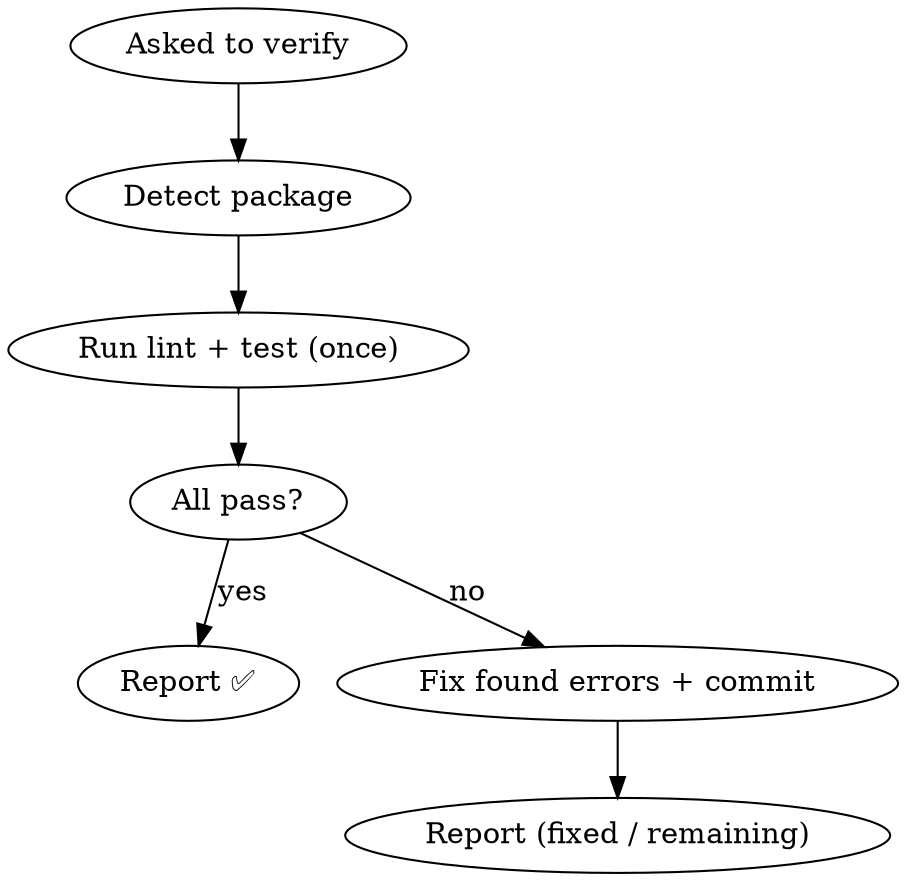

# Make `shared-verification` a Manual, Opt-in Tool (rename to `verify-package`)

**Date:** 2026-06-15
**Status:** Approved (pending implementation)
**Affected skills:** `shared-verification` → rename to `verify-package`, `branch-workflow`
**Out of scope (not modified):** `fix-planning`, `review-workflow`, `finishing-a-development-branch`, `github-pr`, `resolve-pr-review`, `code-review`, all historical `docs/` design files

## Goal

Turn the mandatory, auto-triggered pre-push gate into a **manual, on-demand verification tool**. After this change:

- Lint + unit-test verification runs **only when the user explicitly invokes it** (e.g. "verify this package", "跑一下 lint + test").
- `git push` triggers **nothing**. No skill auto-invokes the tool. No skill references it by slug.
- A single verification pass replaces the up-to-3-round auto-fix loop.

This is a continuation of the 2026-06-04 change ("Remove Auto lint/test from review-workflow and fix-planning"), which consolidated verification under `shared-verification` but kept it as a mandatory gate triggered by the `git push` trigger word. This change removes that trigger-word interception and makes the gate itself opt-in.

## Why

The skill was designed as "mandatory, no exceptions, blocks `git push`, auto-fixes up to 3 rounds, triggers on any push from any skill/workflow/MCP server." In practice this produced two problems:

1. **Invisible, slow auto-runs.** When the gate fires inside a long agent run, the up-to-3-round auto-fix loop balloons wall-clock time, and the user only notices *after* the fact that this skill is the cause. Control and visibility are both poor.
2. **Coupling spread by convention.** The hub enumerates its callers by name (a reverse dependency leak), one skill references it by slug, and several push-initiating skills silently assume it will intercept. None of this is enforced by a hook — it is purely textual convention — yet it ties the skills together.

The user's decision: verification should be **pure opt-in**. `git push` proceeds unverified unless the user has explicitly run verification. There is intentionally **no safety net** — the user accepts responsibility for triggering verification when they want it. This is the maximal-decoupling option and directly fixes the control/visibility pain.

## Non-goals

- **Not** deleting the skill — it remains as a manual tool, renamed `verify-package`.
- **Not** adding any hook or automatic enforcement (the user explicitly rejected a safety net).
- **Not** adding "remember to verify" reminders to push-initiating skills (zero-reference is the cleanest decoupling and is consistent with the no-safety-net decision; this mirrors the 2026-06-04 doc's rejected "Approach C", whose justification — "trigger-word interception covers it" — no longer applies but whose conclusion the user reaffirms for a different reason).
- **Not** rewriting historical design docs (2026-06-04 spec/plan, `code-review/docs/*`). They describe past state and stay as-is.
- **Not** touching `fix-planning` Step 5 — its "Finding-Level Validation" is semantic (did the fix match the finding's intent), not lint/test, and does not overlap.

## Background: current coupling map (evidence)

Enforcement mechanism: **none**. No hook in `settings.json` / `settings.local.json`, no `~/.claude/hooks` script references the skill. Activation is entirely the model reading the frontmatter `description` and deciding to invoke. All "coupling" is therefore textual.

| Type | Location | Nature |
|------|----------|--------|
| Hub enumerates callers | `shared-verification/SKILL.md:17` | Lists `branch-review-workflow`, `resolve-pr-review`, `fix-planning`, `finishing-a-development-branch`, `executing-plans` by name |
| Hub names sibling | `shared-verification/SKILL.md:142` | References `verification-before-completion` |
| By-slug reference (only one) | `branch-workflow/SKILL.md:123` | "shared-verification intercepts `git push` externally — this skill does NOT bypass it" |
| Implicit (push, no slug) | `resolve-pr-review/SKILL.md:142`, `github-pr/references/create-pr.md:108`, `finishing-a-development-branch/SKILL.md:125` | Push code, assume the gate auto-fires |
| Conceptual duplicate | `finishing-a-development-branch` "Step 1: Verify Tests" | Runs `npm test` itself; independent, in plugin cache |

Excluded: addy-marketplace `shipping-and-launch` (matched only the generic phrase "git push"; different plugin namespace, no relationship). Monorepo project-level skills: zero references.

## Scope of changes

### A. Rename the skill directory

```
mv ~/.claude/skills/shared-verification ~/.claude/skills/verify-package
```

The `docs/` subtree (including this file and the 2026-06-04 spec/plan) moves with it. After this, the slug `shared-verification` no longer exists as a live skill.

### B. `verify-package/SKILL.md` — full rewrite

Target content (manual tool):

```markdown
---
name: verify-package
description: Use when the user explicitly asks to run lint + unit-test verification on a package. Runs lint and unit tests once, fixes any errors it finds, and reports results. Manual / on-demand only — never runs automatically and never blocks pushing.
---

# Verify Package

## Overview

On-demand verification tool. When you ask for it, it runs the package's lint
and unit tests once, fixes any errors it finds, commits the fix, and reports
results. You decide what to do next — including whether to push.

**Core principle:** Verification is triggered explicitly. It never runs itself
and never gates `git push`.

## When to Use

Invoke only when the user explicitly asks to verify a package, e.g.:
- "verify this package" / "跑一下 lint + test" / "run verification"
- Before a push *if the user chooses to* — never automatically

This skill does NOT:
- Trigger on `git push`
- Get auto-invoked by other skills, workflows, or MCP servers
- Block or gate any push

## Process



## Step 1: Detect Package

1. Find nearest `package.json` from current working directory
2. Read `name` field → use for `pnpm --filter <name>`
3. Read `scripts` field:
   - Has `lint` → will run lint
   - Has `test:unit` → will run `test:unit --run`
   - Missing either → skip that check, warn the user

## Step 2: Run Verification (Single Pass)

1. **Run lint:** `pnpm --filter <package-name> lint`
2. **Run test:** `pnpm --filter <package-name> test:unit --run`
3. **Evaluate:**
   - Both pass → report ✅
   - Any failure → fix the found errors, commit, report

### Fix Behavior

- **Lint:** if `--fix` is available, run it first, then fix remaining errors manually.
- **Test:** fix the source code causing the failure. Do NOT modify test files unless the test is clearly wrong.
- **After fixing:**
  ```bash
  git add -A
  git commit -m "fix: resolve lint/test errors"
  ```
- **Single pass — no loop.** After one fix attempt, report. If errors remain,
  list them and let the user decide. The user can re-run this skill to confirm.

## Step 3: Result

- **All pass:** report ✅ with counts.
- **Fixed:** report what was fixed and current status; note that the user can
  re-run to confirm.
- **Still failing after the fix attempt:** report remaining errors. Let the user handle them.

You decide whether to `git push` — this skill does not.

## Boundaries

**This skill DOES:**
- Run lint + test on demand (single pass)
- Fix errors it finds, once, and commit
- Report results

**This skill does NOT:**
- Trigger on `git push` or gate any push
- Get auto-invoked by other skills
- Loop multiple rounds
- Modify test files (unless a test is clearly wrong)

**Related:** `verification-before-completion` handles "don't claim success
without evidence" — a separate concern, not invoked from here.
```

Removed from the original, explicitly:
- Frontmatter trigger language ("Use before ANY pushing — mandatory pre-push gate … Triggers on git push from any skill, workflow, or MCP server").
- "When to Use" auto-trigger block including "ALWAYS before `git push`" and "Trigger word: `git push`".
- The caller enumeration (original L17).
- The 3-round loop in the process digraph and Step 2.
- "Red Flags — STOP" section (all auto-trigger enforcement).
- "BLOCK push" result behavior — replaced with "report, user decides".
- The original "Common Mistakes" table rows about pushing-without-verification (no longer applicable).

Retained (reworded): package detection, lint/test commands, the "don't modify tests" rule, the `verification-before-completion` related-skill note.

### C. `branch-workflow/SKILL.md` — remove the by-slug line

In the `## Integration` section (L121-126), delete only:

```
- **shared-verification** intercepts `git push` externally — this skill does NOT bypass it
```

Keep the other two integration bullets (`github-pr`, `finishing-a-development-branch`) — they describe division of labor, not verification, and remain accurate.

## Out of scope (intentionally not changed)

| Skill / file | Why untouched |
|--------------|---------------|
| `fix-planning/SKILL.md` | Step 5 is semantic finding-validation, not lint/test (already cleaned in 2026-06-04). |
| `review-workflow/references/local-branch.md` | Lint/test already removed in 2026-06-04. |
| `finishing-a-development-branch/SKILL.md` | Superpowers plugin cache — edits are overwritten on update; its own `npm test` check is independent and never referenced the gate. |
| `github-pr/references/create-pr.md`, `resolve-pr-review/SKILL.md` | Push code but never named the gate; leaving them reference-free is the cleanest decoupling. |
| `code-review/SKILL.md` | Already declares it does not run lint/test. |
| Historical `docs/` (2026-06-04 spec/plan, `code-review/docs/*`) | Records of past decisions; not runtime behavior. |

## Validation after change

After applying the edits, these statements must hold:

1. The directory `~/.claude/skills/shared-verification` no longer exists; `~/.claude/skills/verify-package` does, with `name: verify-package` in its SKILL.md frontmatter.
2. `grep -rn "shared-verification" ~/.claude/skills --include="*.md"` returns matches **only** inside historical `docs/` files — zero matches in any live SKILL.md or referenced `.md`.
3. `verify-package/SKILL.md` frontmatter `description` contains no "git push" trigger language and no "mandatory" / "pre-push gate" wording.
4. `verify-package/SKILL.md` contains no "Red Flags" section, no caller enumeration, and no multi-round (round 2 / round 3) loop.
5. `branch-workflow/SKILL.md` `## Integration` section contains no `shared-verification` bullet; its other bullets are unchanged.
6. No new hook is added to `settings.json` / `settings.local.json`.

## Relationship to the 2026-06-04 change

The 2026-06-04 change removed lint/test from `review-workflow` and `fix-planning` and kept `shared-verification` as the single mandatory gate. This change takes the next step: it makes that single entry point itself manual. The 2026-06-04 doc's "Future extensions" anticipated a reminder line in push skills and rejected it because trigger-word interception covered the gap; this change removes the interception, and the user reaffirms "no reminder" for the explicit reason that there is no safety net by design.
